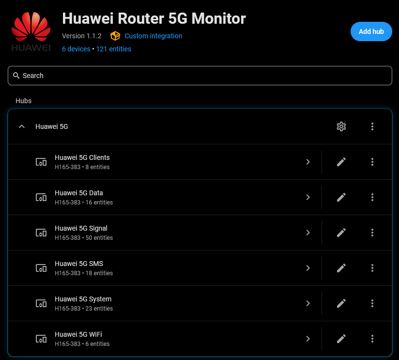
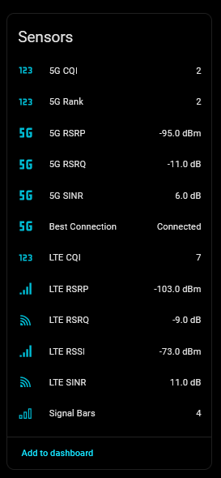
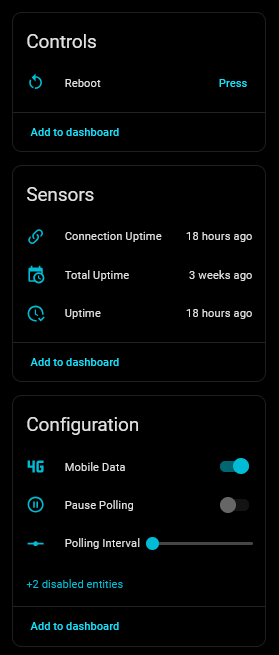
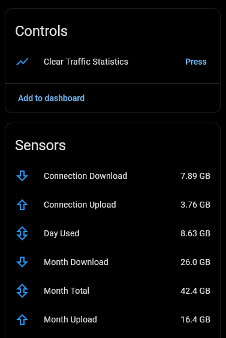
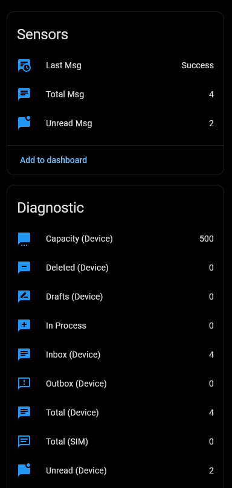
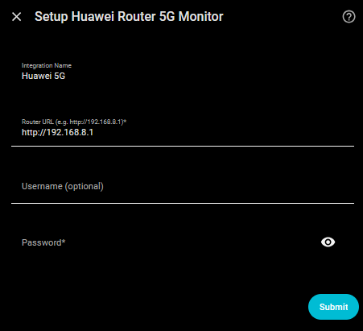
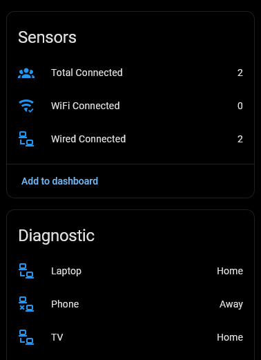

# Huawei Router 5G Monitor for Home Assistant

[](https://hacs.xyz/) [](https://hacs.xyz/docs/faq/custom_repositories) [](https://github.com/PlayFaster/ha-huawei-router-5g-monitor/releases) [](https://opensource.org/licenses/Apache-2.0) [](https://github.com/PlayFaster/ha-huawei-router-5g-monitor/actions/workflows/validate.yaml)  [](https://github.com/PlayFaster/ha-huawei-router-5g-monitor/commits/main)

A Home Assistant integration for **Huawei 5G/LTE Routers** providing Signal Stats, Data Usage, Client Tracking & SMS Management.

> [!NOTE]
>
> **Is this the right integration for you?**
>
> - **Most users** with a Huawei LTE/5G router should use the official [Huawei LTE](https://www.home-assistant.io/integrations/huawei_lte/) core integration — it is well-maintained, broadly compatible, and fully supported.
> - **If you only want SMS features** on top of the core integration, consider pairing it with [@william-aqn's huawei_lte_extended](https://github.com/william-aqn/huawei_lte_extended) component.
> - **This integration is for you if** you want the core integration's features _plus_ any of the following:
>   - **Polling control** — Pause polling and adjust the scan interval dynamically from the HA UI or via automation.
>   - **Connected client tracking** — dynamically created `device_tracker` entities for every discovered LAN/WLAN client.
>   - **SMS Management** — View the most recently received or sent message content and attributes directly in HA.
>
> This project builds on the excellent work of [Salamek/huawei-lte-api](https://github.com/Salamek/huawei-lte-api) and the Home Assistant core [Huawei LTE](https://www.home-assistant.io/integrations/huawei_lte/) integration.

## 📋 Table of Contents

- [Huawei Router 5G Monitor for Home Assistant](#huawei-router-5g-monitor-for-home-assistant)
  - [📋 Table of Contents](#-table-of-contents)
  - [🔧 Compatibility \& Tested Devices](#-compatibility--tested-devices)
  - [🎯 Use Cases](#-use-cases)
  - [✅ Features](#-features)
  - [🔍 What You Get](#-what-you-get)
  - [📸 Screenshots](#-screenshots)
  - [💡 Example Automations](#-example-automations)
  - [📥 Installation](#-installation)
  - [🔧 Configuration](#-configuration)
  - [🔩 Under the Hood - Technical Architecture](#-under-the-hood---technical-architecture)
  - [❓ FAQ \& Troubleshooting](#-faq--troubleshooting)
  - [❗ Known Limitations /❔ What's Missing?](#-known-limitations--whats-missing)
  - [❌ Removal](#-removal)
  - [📝 Maintenance Status](#-maintenance-status)
  - [🤝 Contributors \& Acknowledgements](#-contributors--acknowledgements)
  - [🔀 Other Options](#-other-options)
  - [📄 License](#-license)

## 🔧 Compatibility & Tested Devices

**📟 Router Hardware:**

- **Fully Tested**:
  - **Huawei 5G CPE Pro 6 (H165-383)** — tested firmware: `4.4.0.1(H1600SP2Cxxxx)`
  - _This is currently the primary model verified on live hardware._

- **Expected Compatible (Huawei HiLink XML API Family)**:
  - Other Huawei, Brovi, and SoyeaLink 5G/4G cellular routers supported by the `huawei-lte-api` library or Home Assistant core are expected to work, including:
    - **Huawei 5G CPE Series**: **H112-370 / H112-372** (5G CPE Pro), **H122-373** (5G CPE Pro 2), **H138-380** (5G CPE Pro 3), **H155-381 / H158-381** (5G CPE Pro 5), **H312-371** (5G Outdoor CPE).
    - **Brovi & SoyeaLink Rebranded 5G/LTE Models**: **Brovi 5G CPE Pro**, **Brovi E3372-325**, **SoyeaLink B535-333**.
    - **Huawei 4G/LTE B-Series CPEs**: **B525**, **B528**, **B535**, **B618**, **B715**, **B818** (4G Router 3 Prime), **B310**, **B315**.
    - **Huawei HiLink USB Modems / Mobile Wi-Fi**: **E3372**, **E8372**, **E5573**, **E5577** (in HiLink / Ethernet mode).
  - _(Note: While protocol support for these models is built into `huawei-lte-api`, they remain unverified on live hardware for this custom integration)._

- **Not Compatible (Incompatible Router Families)**:
  - ❌ **Huawei Landline & Mesh Wi-Fi Routers (WS5200, AX3, AX3 Pro, WiFi Mesh 3/7)** — These landline mesh routers do not run the cellular HiLink modem API. Use **[`vmakeev/huawei_mesh_router`](https://github.com/vmakeev/huawei_mesh_router)** instead.
  - ❌ **Legacy VDSL/Fiber Gateways (e.g. Huawei HG659)** — These use gateway-specific presence detection APIs. Use **[`JohnPaton/huawei-hg659`](https://github.com/JohnPaton/huawei-hg659)** instead.
  - ❌ **Non-Huawei / Non-HiLink hardware.**

**🌐 Network:**

- Local network access to the router is required.

**🏠 Home Assistant Version:**

- Minimum: Home Assistant **2025.1**
- Minimum Python: **3.12+** (this is built into and handled by HA, but relevant for non-standard installs).

## 🎯 Use Cases

- **Signal Monitoring**: Near-real-time and historical 5G/LTE signal data enable the monitoring of router performance.
  - **Best Signal**: Use signal diagnostics (RSRP, SINR) to optimize the physical placement or orientation of your router.
  - **Performance Tracking**: Use signal history to check whether the performance from your 5G/LTE ISP is stable or changing.
  - **Connection Quality**: Know if your router has dropped to a lower capability 4G/LTE only connection.
- **Data Cap Management**: Create automations to get notified when your usage crosses a threshold you set (for example, as you approach your monthly data limit) to avoid unexpected overage charges on limited 5G plans.
- **Smart SMS Gateway**: Use your router as a notification bridge; for example, forward home security alerts to your phone via SMS if your primary internet connection goes down.
  - **Obligatory Warning**: It is _**YOUR**_ responsibility to understand whether having your Router send SMS messages is going to incur an extra charge from your ISP.

## ✅ Features

> [!TIP]
>
> **What this adds over the Home Assistant core Huawei LTE integration:**
>
> - **Polling Control**: A Pause Polling switch and a configurable, dynamically adjustable scan interval — set it from the UI or drive it via automation.
> - **Connected Client Tracking**: Automatically creates `device_tracker` entities for every discovered LAN/WLAN client, dynamically updated as devices join and leave.
> - **SMS Management**: Most recent SMS as text sensor, all SMS inbox counts, actions to read, send, and delete SMS.

### 📡 Advanced 5G/LTE Diagnostics

- **Detailed Signal Metrics**: RSRP, RSRQ, RSSI, and SINR for both the 5G NR and the LTE anchor cell.
- **RF Engineering Data**: Monitor CQI, MCS, Transmit Power, and Carrier Aggregation status.
- **Frequency Tracking**: Active 5G/LTE bands, EARFCN, and uplink/downlink frequencies.

### 📉 Data Usage Tracking

- **Monthly Data Usage**: Track your monthly download, upload and total data usage.
- **Session Usage**: Track your download and upload for this session/connection (i.e. since last router restart).
- **Daily Usage**: Track your total usage (upload + download) for today.
- **Download & Upload Speed**: Track your upload and download speeds. Note: This is valid, but only at the instant data was fetched from the router.

### 📋 Essential Router Management

- **Router Management**: Reboot button, Mobile Data toggle, and Guest WiFi controls.
- **Connected Clients**: Dynamic device tracking for every discovered LAN/WLAN client.
- **Preferred Network Mode**: Select between Auto, 4G Only, 5G Only, and other available modes.
- **100% Local**: No cloud account or internet access required.

### 🔄 Dynamic Polling

This integration features **dynamic polling**, the ability to pause polling completely or to change the polling interval.

- **Pause Polling**: Switch to halt polling when you need uninterrupted access to the router's web UI (Huawei only allows a single active login session).
- **Configurable Update Interval**: Dynamically adjust the scan interval (30s to 1 hour, default `180` seconds) via a number entity or automation.

> [!TIP]
>
> **Polling Interval can be controlled dynamically, via automation**
>
> - Set it to 30 seconds during periods of heavy use, to examine connection quality or when you need to receive new SMS messages quickly, and set it higher afterwards, to avoid taxing the router and your Home Assistant database.

### 💬 SMS Management Actions

Provides unread SMS count and latest message content sensors, a `huawei_router_5g_sms_received` event for automation triggers, and four service actions for full programmatic control.

- The `Last Msg` sensor displays the most recent message received **OR** _sent_.
- In the examples below, the `entry_id:` of your router, where required, is drop-down menu selectable from the editor GUI.

> The `delete_all_sms` service action below provides programmatic cleanup of your inbox, and accepts a `keep_last` parameter to preserve recent messages.

#### `huawei_router_5g.send_sms`

Send an SMS message via the router.

| Parameter | Required | Description |
| :-- | :-- | :-- |
| `entry_id` | No | The router to use. Optional if only one router is configured. |
| `target` | **Yes** | Recipient phone number(s) (e.g. `+353871234567`). |
| `message` | **Yes** | Message content. |

```yaml
action: huawei_router_5g.send_sms
data:
  target: "+1234567891011"
  message: "Hello from Home Assistant!"
```

#### `huawei_router_5g.delete_sms`

Delete a single SMS by its storage index. Use the `index` field from `get_sms_list` or from the `huawei_router_5g_sms_received` event.

| Parameter | Required | Description |
| :-- | :-- | :-- |
| `entry_id` | No | The router to use. Defaults to your only router; required if more than one is configured. |
| `index` | **Yes** | Storage index of the message to delete (integer ≥ 0). |

```yaml
action: huawei_router_5g.delete_sms
data:
  entry_id: <your_config_entry_id>
  index: 3
```

#### `huawei_router_5g.delete_all_sms`

Bulk delete SMS messages from the router inbox.

| Parameter | Required | Default | Range | Description |
| :-- | :-- | :-- | :-- | :-- |
| `entry_id` | No | — | — | The router to use. Defaults to your only router; required if more than one is configured. |
| `keep_last` | No | `0` | 0–50 | Number of most recent messages to preserve. `0` deletes all. |

```yaml
action: huawei_router_5g.delete_all_sms
data:
  entry_id: <your_config_entry_id>
  keep_last: 5
```

#### `huawei_router_5g.get_sms_list`

Fetch a list of SMS messages. Supports **Action Responses** — use the output directly in automations and scripts.

| Parameter | Required | Default | Range | Description |
| :-- | :-- | :-- | :-- | :-- |
| `entry_id` | No | — | — | The router to use. Defaults to your only router; required if more than one is configured. |
| `page` | No | `1` | 1–100 | Page number for pagination. |
| `count` | No | `20` | 1–50 | Messages per page. |
| `box_type` | No | `1` | See below | Mailbox to read from. |

**`box_type` values:** `1` Local Inbox · `2` Local Sent · `3` Local Draft · `4` Local Trash · `5` SIM Inbox · `6` SIM Sent · `7` SIM Draft · `8` Mix Inbox · `9` Mix Sent · `10` Mix Draft

**Response — each message in `messages`:**

| Field     | Type    | Description                                                  |
| :-------- | :------ | :----------------------------------------------------------- |
| `index`   | Integer | Storage index — pass to `delete_sms` to delete this message. |
| `phone`   | Text    | Sender's phone number.                                       |
| `content` | Text    | Message body.                                                |
| `date`    | Text    | Date/time string.                                            |
| `read`    | Boolean | `true` if read, `false` if unread.                           |

```yaml
action: huawei_router_5g.get_sms_list
data:
  entry_id: <your_config_entry_id>
  count: 50
  box_type: 1
response_variable: inbox
```

#### `huawei_router_5g_sms_received` Event

Fires automatically when a new incoming SMS is detected. Use as an automation trigger.

| Field | Type | Description |
| :-- | :-- | :-- |
| `entry_id` | Text | Config entry ID of the router that received the message. |
| `phone` | Text | Sender's phone number. |
| `content` | Text | Message body. |
| `date` | Text | Date/time of the message. |
| `index` | Integer | Storage index — pass directly to `delete_sms` to delete after processing. |

## 🔍 What You Get

This integration provides **159 entities** (some disabled by default, and a few unpopulated depending on your firmware) organized into six logical devices: **System**, **Signal**, **Data**, **SMS**, **WiFi**, and **Clients** — plus one `device_tracker` per discovered client, so the live total is higher.

> [!NOTE]
>
> Entity Visibility: To keep your Home Assistant UI clean, some entities are disabled by default. You can enable them via the Entities tab in the device settings.

| Sub-Device | Entity Types (+disabled) | Key Metrics | Disabled by Default |
| :-- | :-- | :-- | :-- |
| 🔧 **System** | 12 Sensors, 1 Binary Sensor, 2 Switches, 2 Buttons, 1 Select, 1 Number (+4) | Firmware, WAN/LAN IPs, DNS Servers, Uptime timestamps, Refresh Now, Mobile Data, Pause Polling, Network Mode, Polling Interval | Uptime Duration, Connection Duration, Total Connection Duration, Battery |
| 📶 **Signal** | 44 Sensors, 6 Binary Sensors | LTE RSRP/RSRQ/RSSI/SINR, 5G RSRP/RSRQ/SINR, CQI, MCS, Bands, Frequency | None |
| 📈 **Data** | 11 Sensors, 1 Button (+4) | Monthly Usage, Near-real-time Speed, Connection Usage, Daily Usage | Max Download Rate, Max Upload Rate, Month Download (GB), Month Upload (GB) |
| 💬 **SMS** | 17 Sensors, 1 Binary Sensor (+1) | Unread Count, Inbox/Outbox/Drafts Counts, Last Received Message Content & Attributes | SMS Storage Full |
| 🛜 **WiFi** | 4 Binary Sensors, 1 Switch (+1) | User Capacity, Guest WiFi toggle & SSID attribute | User Capacity |
| 👥 **Clients** | 3 Sensors, 1+ Device Tracker | Total Connected, Wired Connected, WiFi Connected, Dynamically tracked LAN/WLAN Clients | None |
| 🔩 **SMS Actions** | 4 Actions | Send, Delete, and List SMS | — |

> [!TIP]
>
> **Clean up your UI: Disable Unnecessary Devices or Entities**
>
> - If you are running in Bridge Mode, you may not need the Clients sub-device
> - If you never use the Router's SMS you may not need the SMS sub-device
> - Devices can be disabled from the main device page: (⋮ menu) > **Disable Device** which also disables all the device entities.
> - Individual entities can be disabled via the entity properties, or in bulk on the entities list page.

### ℹ️ What Each Entity Means — the `about` Attribute

Every entity this integration creates carries an **`about`** attribute: a short note saying what the reading means and, where it matters, what it does **not** mean. Open any entity's More Info dialog, or look at it in **Developer Tools → States**, and the note is there.

It exists because a lot of these entities are not self-explanatory from their names, and several read as contradictions until you know why:

| Entity | What the note tells you |
| :-- | :-- |
| **Primary Band** vs **LTE Band** | One is the anchor carrier, the other the full aggregation. They disagree by design. |
| **Secondary Cell PCI** | An identifier, not a measurement, despite reading as a small integer. |
| **Counters Last Reset** vs **Billing Cycle Day** | The manual clear, and the billing boundary. They are routinely months apart. |
| **Month Connected Time** | Connected time, not elapsed time — and not the denominator behind Projected Usage. |
| **Projected Usage** | An estimate. Its `confidence` attribute is how to judge it, and it deliberately carries no `state_class`. |
| **Router Diagnostics** vs **Integration Health** | The router's verdict, and this integration's. They can disagree, and that is not a fault. |

The full list is in [`docs/about_attribute_list.md`](docs/about_attribute_list.md), which a test reconciles against the code in both directions.

The note is excluded from the recorder, so it costs nothing in database size however often the entity changes.

### 📊 Long Term Statistics (LTS)

Home Assistant stores Long Term Statistics for numeric sensors that have a `state_class` set. This integration enables LTS only for sensors where long-term trend data is genuinely useful:

| Sensors with LTS enabled | Why |
| :-- | :-- |
| LTE & 5G signal metrics (RSRP, RSRQ, RSSI, SINR) | Track connection quality trends over time |
| Signal Bars (LTE & 5G) | Coarse signal summary over time |
| Monthly data usage (Download, Upload, Total) | Monitor data consumption month-over-month |
| Lifetime totals (Total Download, Upload, Data) | Cumulative lifetime traffic |
| Day Used | Daily usage accumulation |
| Connected clients (WiFi, Wired, Total) | Track client count trends over time |
| LTE & 5G CQI | Channel quality indicator trends |
| 5G Rank | MIMO rank over time |
| SMS Unread / Total Msg | Aggregate message volume |
| SMS Total (Device) / Unread (Device) | Per-device storage tracking |

The following sensors have **no LTS** to avoid unnecessary database growth:

| Sensor | Reason |
| :-- | :-- |
| Download / Upload Rate | Instantaneous readings — history at poll intervals has limited analytical value |
| Max Download / Upload Rate | Session maximum, resets; not useful for long-term trends |
| Connection Upload / Download | Resets on every reconnect — session-scoped |
| Connection / Total Connection Duration | Connection time counters; not insightful for LTS |
| Month Download / Upload (GB) | Redundant with the Bytes versions for LTS; HA can display bytes in any unit |
| LTE & 5G Frequencies | Static carrier frequencies — rarely change |
| LTE & 5G Bandwidths | Static channel bandwidths |
| Battery | Always ~100% when plugged in |
| SMS diagnostic sub-counters (inbox, outbox, drafts, etc.) | Per-bank storage counts — no trend value |

> [!TIP]
>
> **Want to add a sensor to Long Term Statistics?**
>
> Add a `state_class` override via [Manual Customization](https://www.home-assistant.io/integrations/homeassistant/#manual-customization) in your `configuration.yaml`. For example, to track Download Rate in LTS:
>
> ```yaml
> homeassistant:
>   customize:
>     sensor.huawei_5g_data_download_rate:
>       state_class: measurement
> ```
>
> Restart Home Assistant after saving. The sensor will begin accumulating LTS from that point forward.

## 📸 Screenshots

### Integration Overview



| Signal | System |
| :-: | :-: |
|  |  |

| Data | SMS |
| :-: | :-: |
|  |  |

| Setup | Clients |
| :-: | :-: |
|  |  |

## 💡 Example Automations

Entity IDs below use the default prefix huawei_5g. If you set a custom name during setup, or have renamed since, replace huawei_5g with your configured prefix.

### 💬 SMS Examples

#### 📨 Forward Incoming SMS to Mobile

This automation fires when a new SMS is detected and forwards the content to your mobile phone.

```yaml
alias: "SMS: Forward to Mobile"
triggers:
  - trigger: event
    event_type: huawei_router_5g_sms_received
actions:
  - action: notify.mobile_app_your_phone
    data:
      title: "New SMS from {{ trigger.event.data.phone }}"
      message: "{{ trigger.event.data.content }}"
```

#### 🧹 Automated Inbox Maintenance

Keep your router's SMS storage clean by automatically deleting old messages while keeping the most recent ones for safety.

```yaml
alias: "SMS: Weekly Inbox Cleanup"
triggers:
  - trigger: time
    at: "03:00:00"
conditions:
  - condition: time
    weekday:
      - sun
actions:
  - action: huawei_router_5g.delete_all_sms
    data:
      entry_id: <your_config_entry_id> # This is GUI selectable in the Automation Editor.
      keep_last: 5
```

#### 📜 Fetch and Process Inbox via Automation

Example of using the `get_sms_list` action response in an automation to count messages from a specific sender.

```yaml
alias: "SMS: Count OTP Messages"
triggers:
  - trigger: time
    at: "09:00:00"
    weekday:
      - mon
      - wed
      - fri
actions:
  - action: huawei_router_5g.get_sms_list
    data:
      entry_id: <your_config_entry_id> # This is GUI selectable in the Automation Editor.
      count: 50
    response_variable: inbox
  - action: notify.persistent_notification
    data:
      message: |
        You have {{ inbox.messages | selectattr('phone', 'search', 'MY_BANK') |
        list | count }} messages from your bank in the inbox.
```

### 🚨 Data Usage Alert

Monitor your data consumption and get notified when you approach your monthly limit. The example below assumes the data sensors display in **GB**. If your sensors are not in GB, check their unit and adjust the thresholds and templates accordingly.

```yaml
alias: "Huawei: High Data Usage Alert"
triggers:
  - trigger: numeric_state
    entity_id: sensor.huawei_5g_data_day_used
    above: 10 # 10 GB - use 10000000000 if the sensor displays Bytes (B)
  - trigger: numeric_state
    entity_id: sensor.huawei_5g_data_month_total
    above: 500 # 500 GB - use 500000000000 if the sensor displays Bytes (B)
actions:
  - action: notify.mobile_app_your_phone
    data:
      title: "High Data Usage Alert"
      message: |
        Significant data usage detected:
        Today: {{ states('sensor.huawei_5g_data_day_used') | float(0) | round(0) }} GB
        This Month: {{ states('sensor.huawei_5g_data_month_total') | float(0) | round(0) }} GB
```

### 📶 Signal Quality Alert

Monitor for poor connection quality based on 5G status, signal bars, and link quality (CQI).

```yaml
alias: "Signal: Poor Quality Connection Alert"
triggers:
  - trigger: state
    entity_id:
      - binary_sensor.huawei_5g_signal_5g_endc_active
      - binary_sensor.huawei_5g_signal_best_connection
    to: "off"
    not_from:
      - "unknown"
      - "unavailable"
    for: "00:05:00"
    note: |
      Ignores unknown and unavailable states so router reboots or transient polling
      failures do not trigger false degradation alerts.
  - trigger: numeric_state
    entity_id:
      - sensor.huawei_5g_signal_5g_signal_bars
      - sensor.huawei_5g_signal_signal_bars
      - sensor.huawei_5g_signal_5g_cqi
    below: 4
    for: "00:05:00"
conditions:
  - condition: or
    conditions:
      - condition: and
        conditions:
          - condition: state
            entity_id: binary_sensor.huawei_5g_signal_5g_endc_active
            state: "off"
          - condition: state
            entity_id: binary_sensor.huawei_5g_signal_best_connection
            state: "off"
      - condition: numeric_state
        entity_id: sensor.huawei_5g_signal_5g_signal_bars
        below: 4
      - condition: numeric_state
        entity_id: sensor.huawei_5g_signal_signal_bars
        below: 4
      - condition: numeric_state
        entity_id: sensor.huawei_5g_signal_5g_cqi
        below: 4
actions:
  - action: notify.mobile_app_your_phone
    data:
      title: "Poor Signal Quality Detected"
      message: |
        The router connection quality is poor.
        - 5G ENDC: {{ states('binary_sensor.huawei_5g_signal_5g_endc_active') }}
        - Best Connection: {{ states('binary_sensor.huawei_5g_signal_best_connection') }}
        - 5G Bars: {{ states('sensor.huawei_5g_signal_5g_signal_bars') }}
        - LTE Bars: {{ states('sensor.huawei_5g_signal_signal_bars') }}
        - 5G CQI: {{ states('sensor.huawei_5g_signal_5g_cqi') }}
```

### 🩺 System Health & Connectivity Alerts

Monitor for router reboots or connection resets by watching the uptime and connection duration sensors.

```yaml
alias: "System: Router Reboot or Reset Alert"
triggers:
  - trigger: template
    value_template: |
       {{ uptime is not none and (now() - uptime).total_seconds() < 120 }}
    id: reboot # Trigger if uptime is less than 2 minutes (indicates a recent reboot)
  - trigger: template
    value_template: |
       {{ conn is not none and (now() - conn).total_seconds() < 120 }}
    id: reconnect # Trigger if connection duration is less than 2 minutes (indicates a recent reconnect)
actions:
  - action: notify.mobile_app_your_phone
    data:
      title: "Huawei Router Notification"
      message: >
        
          The router has rebooted. 
          System Uptime: {{ states('sensor.huawei_5g_system_uptime') }}
        
          The mobile connection was reset/reconnected.
          Connection Uptime: {{ states('sensor.huawei_5g_system_connection_uptime') }}
        
```

### 🔁 Auto-Resume Polling

Ensure polling is turned back on automatically if someone forgets to resume it after managing the router.

```yaml
alias: "Huawei: Auto-Resume Polling"
description: "Turn polling back on after 1 hour if it was manually paused."
triggers:
  - trigger: state
    entity_id: switch.huawei_5g_system_pause_polling
    to: "on"
    for: "01:00:00"
actions:
  - action: switch.turn_off
    target:
      entity_id: switch.huawei_5g_system_pause_polling
```

## 📥 Installation

### ✨ HACS (Recommended)

1. Add this [repository](https://github.com/PlayFaster/ha-huawei-router-5g-monitor) as a **Custom Repository** in HACS:
   - Open HACS in Home Assistant
   - Click **Custom repositories** (⋮ menu)
   - Add repository URL and Type: `Integration`
2. Search for "Huawei Router 5G Monitor" and click **Download**
3. Restart Home Assistant
4. Go to **Settings > Devices & Services > Add Integration** and search for "Huawei Router 5G Monitor"

### 💾 Manual Installation

1. Download the [latest release](https://github.com/PlayFaster/ha-huawei-router-5g-monitor/releases).
2. Copy the `custom_components/huawei_router_5g` folder to your Home Assistant `custom_components` directory
3. Restart Home Assistant
4. Go to **Settings > Devices & Services > Add Integration** and search for "Huawei Router 5G Monitor"

## 🔧 Configuration

### 🔧 Initial Setup

Setup is handled entirely via the UI. You will need the same details that you use for the router's web UI:

- **Host** — Router IP Address/URL (e.g., `http://192.168.8.1` — the Huawei default)
- **Username** — Router login username (often blank for Huawei, otherwise whatever you use in the Router WebUI)
- **Password** — Admin password for the router web interface
- **Name** — Custom prefix for all devices and entities (default: `Huawei 5G`). This determines entity IDs — e.g. the default produces `sensor.huawei_5g_data_month_total`. Change this if you have multiple routers or prefer a different naming scheme.

### 🔩 Runtime Options

After installation, open **Settings > Devices & Services > Huawei Router 5G Monitor > Configure** to adjust:

#### Connection Settings

| Option   | Description                                                 |
| -------- | ----------------------------------------------------------- |
| Host     | Router URL address (change if the router's LAN IP changes). |
| Username | Router login username.                                      |
| Password | Admin password (update if changed on the router).           |

### 🔘 Runtime Controls & Settings (Entities)

Rather than hiding settings in configuration menus, several configuration parameters are exposed directly as Home Assistant control entities, allowing you to monitor and control them from dashboards or automations:

#### 📡 Network Settings (System Device)

- **Preferred Network Mode** (`select.huawei_5g_system_preferred_network_mode`): Select the preferred network mode dynamically. Options include `Auto`, `4G Only`, `5G Only`, `4G/3G/2G Auto`, etc.

#### 🔧 Router Administration & Polling (System Device)

- **Pause Polling** (`switch.huawei_5g_system_pause_polling`): Switch to halt polling to allow exclusive access to the router web UI.
- **Polling Interval** (`number.huawei_5g_system_polling_interval`): Adjust the scan interval slider (30s to 1 hour, default `180` seconds).
- **Refresh Now** (`button.huawei_5g_system_refresh_now`): Trigger an immediate refresh (data fetch). **This works even while Pause Polling is on** — an explicit action always fetches, while scheduled polls stay paused.
- **Mobile Data Switch** (`switch.huawei_5g_system_mobile_data`): Enable or disable the router's mobile data connection.

> [!NOTE]
>
> If the router refuses a control change — mobile data, guest WiFi or network mode — Home Assistant now reports an **error** on the action. Previously the change appeared to succeed and then silently reverted on the next poll, leaving nothing but a log line to explain it.

#### 🛜 WiFi & Client Settings (WiFi Device)

- **Guest WiFi Switch** (`switch.huawei_5g_wifi_guest_network`): Toggle the guest wireless network on or off.

## 🔩 Under the Hood - Technical Architecture

### 🔄 Data Polling & 3-Strike Resilience 🩹

The integration uses a custom `DataUpdateCoordinator` designed for high stability:

- **Zero-Blocking Startup**: Home Assistant starts instantly. Hardware identity is loaded from memory, while the first poll happens quietly in the background.
- **Triggered Refresh**: Actions like **Reboot** or **Delete SMS** trigger an immediate API refresh to provide instant feedback.
- **3-Strike Logic**: To avoid "Unavailable" flickers during momentary router congestion or signal loss:
  1. **First Failure**: Logs a warning; retries immediately.
  2. **Second Failure**: Logs a warning; retries again.
  3. **Third Failure**: Marks all entities as `Unavailable` and logs an error.
- **Auto-Recovery**: Once the router is back online, the integration restores all entities automatically.

### 🆔 Identity & Stable Entities

- **MAC-Based Identity**: The integration uses the router's unique hardware MAC address as the primary key. This ensures that even if your router's IP address changes (DHCP), Home Assistant will track the same device and preserve your history and automations.
- **Flat Identity Pattern**: Device information (Model, MAC, Version) remains stable and visible even if the router is temporarily offline.
- **Reconfiguration**: If you change your router's IP or password, use the **Reconfigure** button on the integration card to update settings without losing any data.
- **Data Validation**: Router values are checked for validity against defined guard limits. Out-of-range sensor values (e.g., impossible signal metrics) are ignored or marked as unknown to ensure data integrity.

### 🔄 Dynamic Polling & Standard System Options

- **Both Available**: The integration provides dynamic polling controls, to pause polling or change polling interval. It also functions normally with the standard Home Assistant **System options** > **Enable polling for changes** toggle.

## ❓ FAQ & Troubleshooting

### 🔌 Connection & Authentication

#### **"Failed to connect to router" Error**

- Verify the IP address is correct (the Huawei default is `192.168.8.1`).
- Confirm the username is `admin`.
- Verify the password is correct (case-sensitive).
- Ensure the router is powered on and not currently rebooting.

#### 🔒 **Why can't I access the router web UI while this integration is running?**

- Huawei routers are generally tolerant of concurrent sessions (e.g., via the web UI and Home Assistant), but it can be an issue.
- Use the **Pause Polling** switch in Home Assistant to halt polling and free up the session.
- Resume polling when you are done with the web UI.

### 🩺 Is the integration itself healthy?

The **Integration Health** sensor (`binary_sensor.huawei_5g_system_integration_health`, on the System device) answers the question the other entities cannot: whether the integration is working, as distinct from whether the router is up.

It exists because the router can answer a poll _successfully_ while a whole capability is missing — SMS, WiFi clients, monthly usage — in which case the affected sensors just go blank with no explanation anywhere. It reports:

| Attribute | What it tells you |
| :-- | :-- |
| `severity` | `null` when healthy, otherwise `warning` or `error` |
| `issues` | Plain-language descriptions of what is wrong; empty when healthy |
| `degraded_capabilities` | Which parts of the router stopped answering, by name |
| `drift` | Set when the router's firmware appears to have renamed the fields this integration reads |
| `last_good_update` | When the last fully successful poll completed |

Two things worth knowing:

- **It is never `unavailable`.** Every other entity correctly goes unavailable when the router is unreachable; this one stays on to explain why.
- **A single failed poll does not turn it on.** A problem must persist for three consecutive polls — except on a cold start, where there are no held values and it flags immediately.

```yaml
automation:
  - alias: "Huawei router integration problem"
    triggers:
      - trigger: state
        entity_id: binary_sensor.huawei_5g_system_integration_health
        to: "on"
        not_from:
          - unknown
          - unavailable
        for: "00:05:00"
    actions:
      - action: notify.persistent_notification
        data:
          title: "Huawei router integration needs attention"
          message: >-
            {{ state_attr('binary_sensor.huawei_5g_system_integration_health', 'issues') | join('; ') }}
```

### 📊 Diagnostics & Entity Values

#### ❔ **Some sensors showing "Unknown"**

- Most sensors showing okay with some unknown **is expected behavior**.
  - The integration fetches everything it can from the router API.
  - Not every metric is provided by every ISP or network configuration.
  - 5G NR sensors will show "Unknown" when the router is operating in LTE-only mode.
  - These sensors can be disabled to avoid clutter.

#### 🛑 **All sensors showing "Unavailable" or "Unknown"**

- This is normal during a router reboot or if the router is temporarily unreachable.
  - The integration will automatically recover once the connection is restored.
- If sensors do not recover, perform these checks:
  - Ensure you can log into the router's web UI (confirms it is up and the password is correct).
  - Check your Home Assistant logs for specific error messages.
  - Delete and re-add the integration.

## ❗ Known Limitations /❔ What's Missing?

- **Firmware Dependencies**: API feature availability varies by ISP and firmware builds.
- **WiFi Toggles**: There are sensors to track the status of 2.4/5GHz WiFi (on/off), and a toggle for the Guest WiFi Network, but no toggles for standard (non-guest) WiFi. This is not planned at this time. Based on my testing this is not possible with my router and the API.
- **Device Tracker Persistence**: Client tracking features depend on the router's internal ARP table. Because of this, offline devices may persist as connected in Home Assistant for a short period after disconnecting from the router.
- **Device tracking creates an entity per network client.** Each carries that device's MAC address, hostname and IP. That is what makes presence detection work, but it does mean the integration holds an inventory of everything on your network — including guests' phones. Two things follow: the per-client attributes are **excluded from long-term history** (they are current state only), and a **diagnostics download replaces every MAC, hostname, IP and SSID with a stable placeholder** before you see it. If you would rather not track clients at all, disable the `device_tracker` entities in Home Assistant; the rest of the integration is unaffected.

## ❌ Removal

To remove the integration from Home Assistant:

1. Go to **Settings > Devices & Services**.
2. Find the **Huawei Router 5G Monitor** card and click into it.
3. Click the **three dots** (⋮) next to the gear icon and select **Delete**.
4. Confirm deletion.

To fully uninstall (HACS):

1. Go to **HACS**.
2. Find **Huawei Router 5G Monitor** and click into it.
3. Click the **three dots** (⋮) at the top right and select **Remove**.
4. Restart Home Assistant.
5. Home Assistant automatically removes all associated entities and device entries from the registry when the integration is deleted.

## 📝 Maintenance Status

This is a **personal project** that exists to fill a specific gap: polling control and connected client tracking on top of what the core Huawei LTE integration already does well. Users who do not need those specific features are encouraged to use the officially maintained [core integration](https://www.home-assistant.io/integrations/huawei_lte/) instead.

Support and updates are provided on a **"best-effort"** basis only. While I use this integration daily and aim to keep it functional with the latest Home Assistant releases, I cannot guarantee immediate fixes for issues or compatibility with all router firmware versions.

### 📖 Documentation Accuracy

- This README is updated whenever the integration changes, and is intended to describe the current release accurately.
- Two things can put it out of step: a passage this document missed during a revision, or a Home Assistant screen or setting that has been renamed or moved since it was written.
- If you find either, please [open an issue](https://github.com/PlayFaster/ha-huawei-router-5g-monitor/issues). It will be corrected.

---

## 🤝 Contributors & Acknowledgements

This integration stands on the shoulders of several excellent open-source projects:

- 🙏 **Home Assistant Core — Huawei LTE Integration** (@scop, @fphammerle, @joostlek, and contributors): The architectural foundation this component builds upon. The core integration is the right choice for most users — this component extends it for a specific niche. A huge thanks for the years of work that went into it.
- 🙏 **[huawei-lte-api](https://github.com/Salamek/huawei-lte-api)** (@Salamek and contributors): The underlying API library that does the heavy lifting of communicating with Huawei hardware. None of this would be possible without it.
- 🙏 **[huawei_lte_extended](https://github.com/william-aqn/huawei_lte_extended)** (@william-aqn): The expanded SMS functionality in this integration is based on this work. If SMS features are what you need, this component paired with the core integration is an excellent option.
- **Personal prior work**: The structure and integration architecture draw on my own custom components for [TP-Link 5G](https://github.com/PlayFaster/ha-tplink-router-5g-monitor) and [ZTE 5G](https://github.com/PlayFaster/ha-zte-router-5g-monitor) routers.
- This project was developed with the assistance of AI to ensure code quality and adherence to best practices.

---

## 🔀 Other Options

This integration is specifically optimized as a high-performance monitor for Huawei, Brovi, and SoyeaLink 5G/4G cellular CPE routers (primarily tested on the **Huawei 5G CPE Pro 6 / H165-383**, and designed for the H-series, B-series, and HiLink USB modems).

Depending on your specific hardware, deployment setup, or preferred feature set, several other excellent Home Assistant options exist:

- 🏠 **[Home Assistant Core: Huawei LTE](https://www.home-assistant.io/integrations/huawei_lte/)** by @scop, @fphammerle, @joostlek, and Home Assistant Core contributors  
  _Best for:_ Most users with a standard Huawei LTE/5G router who want an officially supported, core-maintained integration for basic signal telemetry, data volume, and SMS notifications.

- 💬 **[`william-aqn/huawei_lte_extended`](https://github.com/william-aqn/huawei_lte_extended)** by @william-aqn  
  _Best for:_ Users who are happily running the official HA Core Huawei LTE integration but wish to augment it with expanded SMS inbox sensors and dedicated SMS management services.

- 🌐 **[`vmakeev/huawei_mesh_router`](https://github.com/vmakeev/huawei_mesh_router)** by @vmakeev  
  _Best for:_ Huawei Landline Wi-Fi Mesh and WS-Series Routers (WS5200, AX3, AX3 Pro, WiFi Mesh 3/7). Specialized for LAN/Wi-Fi connected client tracking, guest Wi-Fi control, and mesh node discovery.

- 🔌 **[`JohnPaton/huawei-hg659`](https://github.com/JohnPaton/huawei-hg659)** by @JohnPaton  
  _Best for:_ Legacy Huawei HG659 VDSL/Fiber gateways used for basic device presence detection.

---

## 📄 License

[](https://opensource.org/licenses/Apache-2.0)

This project is licensed under the Apache License, Version 2.0. See [LICENSE](LICENSE) for details.

---

💬 **Questions or Issues?** Visit the [GitHub repository](https://github.com/PlayFaster/ha-huawei-router-5g-monitor).
