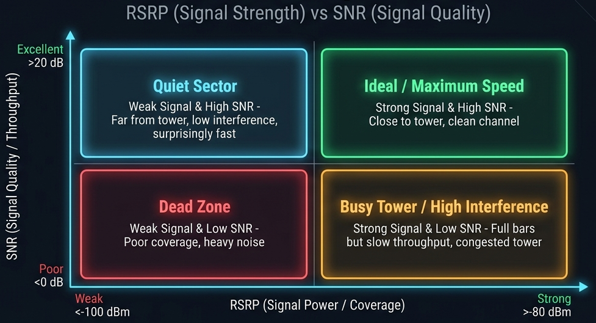
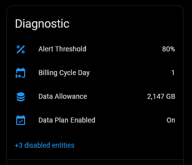
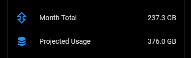
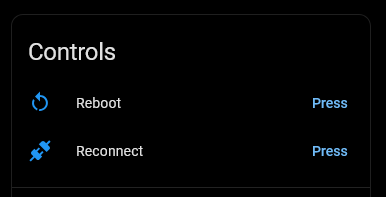
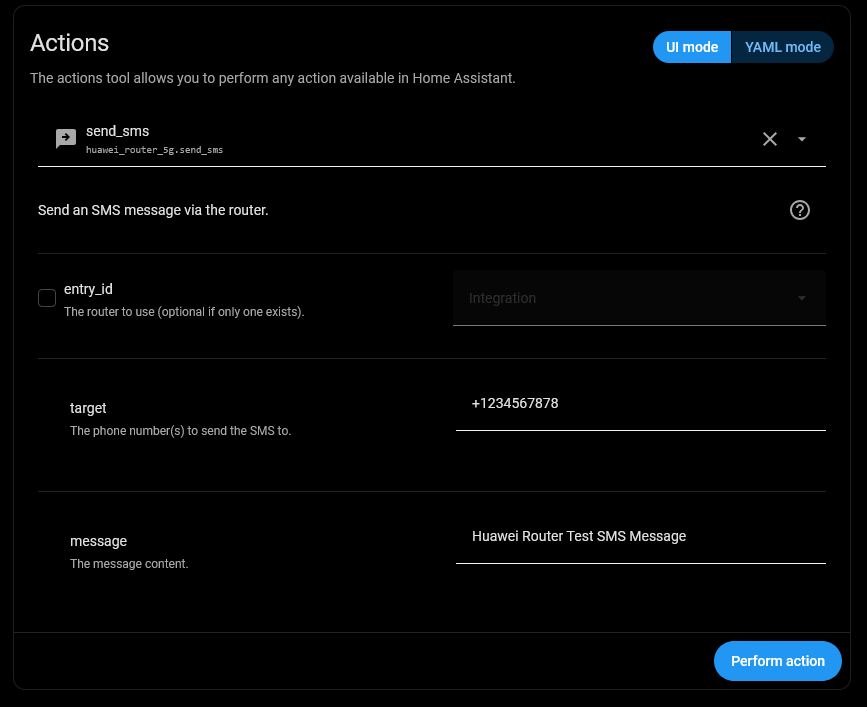
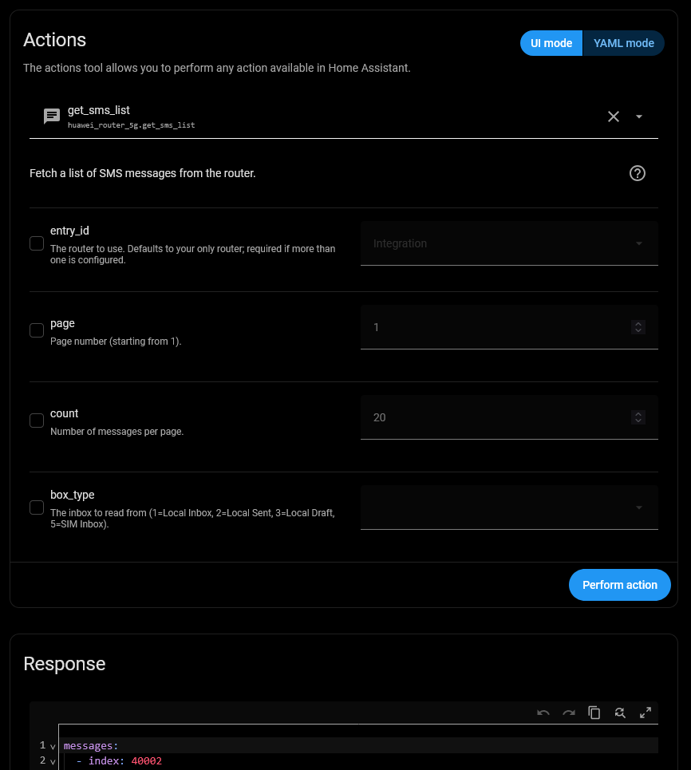
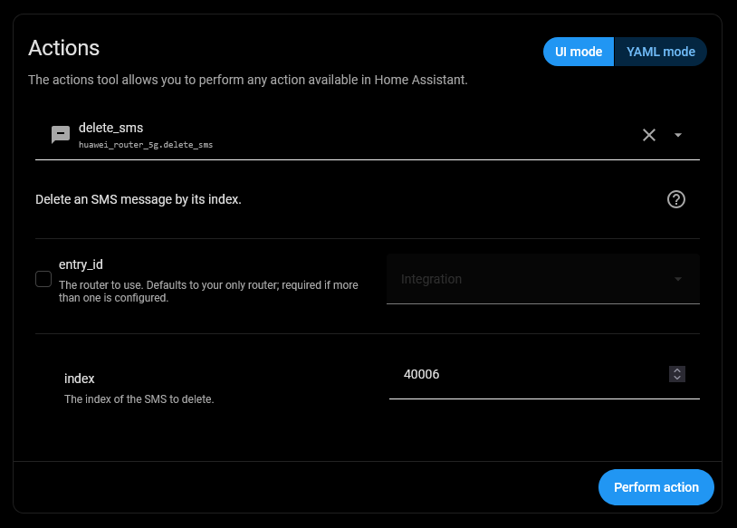
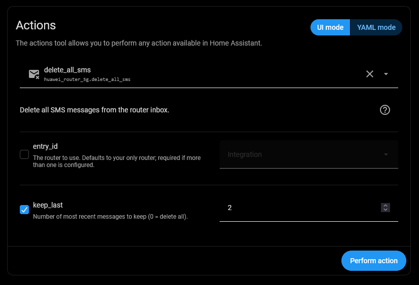

<!-- markdownlint-disable MD033 -->

# Huawei Router 5G Monitor for Home Assistant

[](https://hacs.xyz/) [](https://hacs.xyz/docs/faq/custom_repositories) [](https://github.com/PlayFaster/ha-huawei-router-5g-monitor/releases) [](https://opensource.org/licenses/Apache-2.0) [](https://github.com/PlayFaster/ha-huawei-router-5g-monitor/actions/workflows/validate.yaml)  [](https://github.com/PlayFaster/ha-huawei-router-5g-monitor/commits/main)

---


---

A Home Assistant integration for **Huawei 5G/LTE Routers** providing Signal Stats, Data Usage, Client Tracking & SMS Management.

> [!NOTE]
>
> **Is this the right integration for you?**
>
> - **Most users** with a Huawei LTE/5G router should use the official [Huawei LTE](https://www.home-assistant.io/integrations/huawei_lte/) core integration — it is well-maintained, broadly compatible, and fully supported.
> - **If you only want SMS features** on top of the core integration, consider pairing it with [@william-aqn's huawei_lte_extended](https://github.com/william-aqn/huawei_lte_extended) component.
> - **This integration is for you if** you want the core integration's features _plus_ any of the following:
>   - **Polling control** — Pause polling and adjust the scan interval dynamically from the HA UI or via automation.
>   - **Connected client tracking** — dynamically created `device_tracker` entities for every discovered LAN/WLAN client.
>   - **SMS Management** — View the most recently received or sent message content and attributes directly in HA.
>
> This project builds on the excellent work of [Salamek/huawei-lte-api](https://github.com/Salamek/huawei-lte-api) and the Home Assistant core [Huawei LTE](https://www.home-assistant.io/integrations/huawei_lte/) integration.

## 📋 Table of Contents

- [Huawei Router 5G Monitor for Home Assistant](#huawei-router-5g-monitor-for-home-assistant)
  - [📋 Table of Contents](#-table-of-contents)
  - [🔧 Compatibility \& Tested Devices](#-compatibility--tested-devices)
  - [🎯 Use Cases](#-use-cases)
  - [✅ Features](#-features)
  - [🔍 What You Get](#-what-you-get)
  - [🔘 Controls \& Settings](#-controls--settings)
  - [💬 SMS Actions](#-sms-actions)
  - [📸 Screenshots](#-screenshots)
  - [💡 Example Automations](#-example-automations)
  - [📥 Installation](#-installation)
  - [🔧 Configuration](#-configuration)
  - [🔩 Under the Hood - Technical Architecture](#-under-the-hood---technical-architecture)
  - [❓ FAQ \& Troubleshooting](#-faq--troubleshooting)
  - [❗ Known Limitations /❔ What's Missing?](#-known-limitations--whats-missing)
  - [❌ Removal](#-removal)
  - [📝 Maintenance Status](#-maintenance-status)
  - [🤝 Contributors \& Acknowledgements](#-contributors--acknowledgements)
  - [🔀 Other Options](#-other-options)
  - [📄 License](#-license)

## 🔧 Compatibility & Tested Devices

**📟 Router Hardware:**

- **Fully Tested**:
  - **Huawei 5G CPE Pro 6 (H165-383)** — tested firmware: `4.4.0.1(H1600SP2Cxxxx)`
  - _This is currently the primary model verified on live hardware._

- **Expected Compatible (Huawei HiLink XML API Family)**:
  - Other Huawei, Brovi, and SoyeaLink 5G/4G cellular routers supported by the `huawei-lte-api` library or Home Assistant core are expected to work, including:
    - **Huawei 5G CPE Series**: **H112-370 / H112-372** (5G CPE Pro), **H122-373** (5G CPE Pro 2), **H138-380** (5G CPE Pro 3), **H155-381 / H158-381** (5G CPE Pro 5), **H312-371** (5G Outdoor CPE).
    - **Brovi & SoyeaLink Rebranded 5G/LTE Models**: **Brovi 5G CPE Pro**, **Brovi E3372-325**, **SoyeaLink B535-333**.
    - **Huawei 4G/LTE B-Series CPEs**: **B525**, **B528**, **B535**, **B618**, **B715**, **B818** (4G Router 3 Prime), **B310**, **B315**.
    - **Huawei HiLink USB Modems / Mobile Wi-Fi**: **E3372**, **E8372**, **E5573**, **E5577** (in HiLink / Ethernet mode).
  - _(Note: While protocol support for these models is built into `huawei-lte-api`, they remain unverified on live hardware for this custom integration)._
  - _(Note: Rebranded Brovi/SoyeaLink models report as manufacturer "Huawei" in Home Assistant)_

- **Not Compatible (Incompatible Router Families)**:
  - ❌ **Huawei Landline & Mesh Wi-Fi Routers (WS5200, AX3, AX3 Pro, WiFi Mesh 3/7)** — These landline mesh routers do not run the cellular HiLink modem API. Use **[`vmakeev/huawei_mesh_router`](https://github.com/vmakeev/huawei_mesh_router)** instead.
  - ❌ **Legacy VDSL/Fiber Gateways (e.g. Huawei HG659)** — These use gateway-specific presence detection APIs. Use **[`JohnPaton/huawei-hg659`](https://github.com/JohnPaton/huawei-hg659)** instead.
  - ❌ **Non-Huawei / Non-HiLink hardware.**

**🌐 Network:**

- Local network access to the router is required. No cloud account or internet access is needed.

**🏠 Home Assistant Version:**

- Minimum: Home Assistant **2024.6**
  - Use of `entry.runtime_data` and typed `ConfigEntry[DataUpdateCoordinator]` added in HA **2024.6**.
- Minimum Python: **3.12+** (this is built into and handled by HA, but relevant for non-standard installs).

## 🎯 Use Cases

- **Signal Monitoring**: Live and historical 5G/LTE signal data enable the monitoring of router performance. See [Reading Your Signal Data](#-reading-your-signal-data)
  - **Best Signal**: Use signal diagnostics (RSRP, SINR) to optimize the physical placement or orientation of your router. → [Morning Signal Report](#-morning-signal-report) example.
  - **Performance Tracking**: Use signal history to check whether the performance from your 5G/LTE ISP is stable or changing. → [Cell Tower Change Alert](#-cell-tower-change-alert) example.
  - **Connection Quality**: Know if your router has dropped to a lower-capability 4G/LTE only connection. → [Signal Quality Alert](#-signal-quality-alert) example.
- **Data Cap Management**: Create automations to get notified when your usage crosses a threshold you set (for example, as you approach your monthly data limit) to avoid unexpected overage charges on limited 5G plans. → [Data Usage Alert](#-data-usage-alert) example.
- **Unattended Recovery**: Reconnect the cellular session or reboot the router when the connection stops recovering on its own. → [Auto-Reconnect](#-auto-reconnect-on-prolonged-outage) and [Auto-Reboot](#-auto-reboot-on-prolonged-outage) examples.
- **Smart SMS Gateway**: Use your router as a notification bridge; for example, forward home security alerts to your mobile phone. → [Alert on Incoming SMS](#-alert-on-incoming-sms) example.
  - ❗**Obligatory Warning**: It is _**YOUR**_ responsibility to understand whether having your Router send SMS messages is going to incur an extra charge from your ISP.

## ✅ Features

> [!TIP]
>
> **What this adds over the Home Assistant core Huawei LTE integration:**
>
> - **Polling Control**: A Pause Polling switch and a configurable, dynamically adjustable scan interval — set it from the UI or drive it via automation.
> - **Connected Client Tracking**: Automatically creates `device_tracker` entities for every discovered LAN/WLAN client, dynamically updated as devices join and leave.
> - **SMS Management**: View the most recently received or sent message content, full inbox counts, and dedicated actions to read, send, and delete SMS.
> - **Data Usage Projections**: Forecast end-of-billing-cycle data consumption with confidence gating to prevent early-cycle false alarms.

### 📡 Advanced 5G/LTE Diagnostics

Track signal strength metrics (SINR, RSRP, RSRQ, RSSI), serving cell tower details, and active carrier bands — as often as every 30 seconds.

<details>

<summary>
&nbsp; &nbsp; ➕ &nbsp; &nbsp; Click to Expand for Details:
</summary><br>

- **Detailed Signal Metrics**: SINR, RSRP, RSRQ and RSSI for both the 5G NR and the LTE anchor cell tower.
- **RF Engineering Data**: Monitor CQI, MCS, Transmit Power, and Carrier Aggregation status. See the [Signal Quality Alert](#-signal-quality-alert) example.
- **Frequency Tracking**: Active 5G/LTE bands, EARFCN, and uplink/downlink frequencies.
- **Cell Tower Info**: Monitor Cell ID, eNodeB ID, PCI, and active bands. See the [Cell Tower Change Alert](#-cell-tower-change-alert) example.

---

</details>

<br>

#### 📶 Reading Your Signal Data

This integration reports a lot of signal numbers. This section explains which ones matter, what to expect, and how to compare one setup (location, config) against another.

<details>

<summary>
&nbsp; &nbsp; ➕ &nbsp; &nbsp; Click to Expand for Details:
</summary><br>

#### Start with two numbers

| Look at  | To answer                         | Entity                |
| :------- | :-------------------------------- | :-------------------- |
| **SINR** | _How fast will this actually go?_ | `5G SINR`, `LTE SINR` |
| **RSRP** | _Do I have coverage at all?_      | `5G RSRP`, `LTE RSRP` |

**SINR (Signal Quality) is the best predictor of actual speeds.** It measures usable signal against noise and interference, tracking throughput far more accurately than raw signal bars.

> **SNR and SINR** are related but separate metrics. **SNR** (Signal-to-Noise Ratio) measures the signal against background noise; **SINR** (Signal-to-Interference-plus-Noise Ratio) measures it against noise _plus_ interference from other transmitters. **This integration reports SINR**, as `LTE SINR` and `5G SINR`.

**RSRP (Signal Strength) is raw received power.** It tells you whether the tower is reaching you, not how well the connection will perform.

They move independently, and that is the point:

- **Strong RSRP, poor SINR** — you are close to a busy tower. Plenty of signal, but lots of interference. Speeds disappoint despite "full bars".
- **Weak RSRP, good SINR** — you are far out from the tower but the sector is quiet. Often perfectly usable, and sometimes faster than the first case. 

#### What the numbers mean

| Metric         | Excellent | Good       | Fair        | Poor   |
| :------------- | :-------- | :--------- | :---------- | :----- |
| **SINR** (dB)  | > 20      | 13 to 20   | 0 to 13     | < 0    |
| **RSRP** (dBm) | > −80     | −80 to −90 | −90 to −100 | < −100 |
| **RSRQ** (dB)  | > −10     | −10 to −15 | −15 to −20  | < −20  |
| **RSSI** (dBm) | > −65     | −65 to −75 | −75 to −85  | < −85  |

RSRP, RSRQ and RSSI are negative — **closer to zero is stronger**.

---

| Acronym | Means | Think Of | Answers |
| :-- | :-- | :-- | :-- |
| **SINR** | Signal-to-Interference-plus-Noise Ratio | **"Signal Quality"** | _How fast will this actually go?_ |
| **RSRP** | Reference Signal Received Power | **"Signal Strength"** | _Do I have coverage at all?_ |
| **RSRQ** | Reference Signal Received Quality | **"Connection Congestion"** | _Is the channel congested/busy?_ |
| **RSSI** | Received Signal Strength Indicator | **"Total Power"** | _How much raw RF energy reaches the modem?_ |

---

> [!TIP]
>
> Every signal entity carries an **`about`** note explaining what it measures, and most also give these threshold bands. Click the entity → **⋮ menu → Details**.

#### Treat these as a starting point, not a verdict

What counts as "good enough" is specific to your location. A reading that would be poor for someone 500m from a mast can be entirely fine at 4km on a quiet sector, because the two are limited by different things — interference in the first case, noise in the second.

So the more useful question is almost never _"is −95 dBm good?"_. It is:

- **Is this position better than that position?**
- **Is today worse than last week?**

Both are comparisons, and both need readings over time rather than the number on screen right now.

#### Establish your own baseline

When the connection is performing well, note your SINR, RSRP, and RSRQ values. **That is your reference.** A subsequent drop in SINR from 18 dB to 4 dB tells you far more than a generic lookup table.

#### Comparing over time (no code needed)

Individual readings fluctuate with radio traffic. Home Assistant can average readings for smooth comparison:

1. Go to **Settings → Devices & Services → Helpers → Create Helper**
2. Choose **Combine the state of several sensors** → **Statistics**
3. Select **`5G SINR`** (or **`LTE SINR`** if operating in LTE-only mode).
4. Set characteristic to **Arithmetic mean** and max age to **15 minutes**.

Use this smoothed sensor to compare different orientations or monitor historical degradation over time in a History card. Create a second one for RSRP if you are aligning an antenna.

#### Is there one number for overall quality?

Simple Answer — **No**

There is no standard formula combining SINR, RSRP and RSRQ into a single score, because the bottleneck limiting _your_ connection depends on whether your site is noise-limited or interference-limited. The two closest indicators are:

- **SINR** — the best single indicator of usable throughput.
- **`Signal Bars`** (0–5) — the router's own composite. Coarse and vendor-defined, but it is the manufacturer's own summary.

If you want one number on a dashboard, use SINR.

---

</details>

<br>

### 📉 Data Usage Tracking

Monitor daily and monthly data consumption, active session totals, and upload/download speeds, plus estimated projected monthly (billing-cycle) data usage.

<details>

<summary>
&nbsp; &nbsp; ➕ &nbsp; &nbsp; Click to Expand for Details:
</summary><br>

- **Monthly Data Usage**: Track your monthly download, upload and total data usage. See the [Data Usage Alert](#-data-usage-alert) example.
- **Session Usage**: Track your download and upload for this session/connection (i.e. since last router restart).
- **Daily Usage**: Track your total usage (upload + download) for today.
- **Download & Upload Speed**: Track your upload and download speeds. Note: This is valid, but only at the instant data was fetched from the router.
- **Billing Cycle Day** (`sensor.huawei_5g_data_billing_cycle_day`): The day of the month the router zeroes its counters. This is the router's own billing cycle and need not be the 1st — worth checking against your provider's bill.
- **Projected Usage** (`sensor.huawei_5g_data_projected_usage`): An estimate of where you will finish the cycle at your current rate. See [Understanding the usage projection](#understanding-the-usage-projection) below.

| Data Sensors | Data Diagnostics |
| :-: | :-: |
|  |  |

---

#### Understanding the usage projection

**Projected Usage** answers the question standard usage counters do not: _am I on course to stay within or exceed my allowance?_

See the [Projected Overage Alert](#-projected-overage-alert) automation example.

The forecast projects end-of-month usage by applying your daily run-rate across the remaining cycle days. Day 1 readings clamp conservatively to prevent early swings; accuracy increases steadily from day 2 onward.



| Attribute | Meaning |
| :-- | :-- |
| `confidence` | `low`, `medium`, or `high` — how much of the figure rests on observed usage rather than extrapolation. Reaches `high` around a quarter of the way through a cycle. |
| `basis` | How the estimate was calculated (e.g. `run_rate_only`). |
| `cycle_day` | Where you are in the cycle, e.g. `12 of 31`. |
| `cycle_start` | The date the current cycle began. |
| `cycle_source` | `router` when resolved from `Billing Cycle Day`, or `calendar_assumed` when defaulting to the 1st of the month. |

**It is not recorded in long-term statistics** by design. It is an end-of-cycle estimate useful for live alerting rather than historical tracking (historical data volume is already tracked by **Month Total**).

To avoid false alarms at cycle rollover, gate your automations on the `confidence` attribute:

```yaml
condition:
  - condition: template
    value_template: |
      {{ state_attr('sensor.huawei_5g_data_projected_usage', 'confidence') != 'low' }}
```

**Billing Cycle Alignment**: The calculation synchronizes with the router's **Billing Cycle Day** (`sensor.huawei_5g_data_billing_cycle_day`) if configured (and calendar month, if not set), automatically adjusting for varying month lengths.

---

</details>

<br>

### 📋 Essential Router Management

Reboot router hardware directly from Home Assistant and monitor data integrity with automated self-diagnostics.

<details>

<summary>
&nbsp; &nbsp; ➕ &nbsp; &nbsp; Click to Expand for Details:
</summary><br>

- **Router Management**: Reboot button, Mobile Data toggle, and Guest WiFi controls. See the [Auto-Reboot on a Prolonged Outage](#-auto-reboot-on-prolonged-outage) example.
- **Connected Clients**: Dynamic device tracking for every discovered LAN/WLAN client.
- **Preferred Network Mode**: Select between Auto, 4G Only, 5G Only, and other available modes.
- **Self-Diagnosis**: An **Integration Health** binary sensor reports if the integration is experiencing issues, including data fetches that _succeeded_ but return nothing usable. See [Self-Diagnosis](#-self-diagnosis) and the [Integration Health Problem Alert](#-integration-health-problem-alert) example.

| System Control | System Diagnostics |
| :-: | :-: |
|  |  |

---

</details>

<br>

### 🔄 Dynamic Polling

This integration features **dynamic polling**, the ability to pause polling completely or to change the polling interval.

<details>

<summary>
&nbsp; &nbsp; ➕ &nbsp; &nbsp; Click to Expand for Details:
</summary><br>

- **Pause Polling**: Switch to halt polling when you want to avoid extra network requests while managing the router's web UI. See the [Auto-Resume Polling](#-auto-resume-polling) example.
- **Configurable Update Interval**: Dynamically adjust the scan interval (30s to 1 hour, default `180` seconds) via a number entity or automation. See the [Dynamic Polling Interval](#-dynamic-polling-interval) example.
- **Actions Always Fetch**: Pressing **Refresh Now**, making a settings change (switch/select) or an SMS action fetches immediately **even while paused** — only scheduled polls are suppressed. See the [Morning Signal Report](#-morning-signal-report) example.
- **Standard System Option**: Also honours Home Assistant's **System options > Enable polling for changes** toggle.


---

</details>

<br>

### 💬 SMS Management Actions

With SMS count and text sensors, plus monitoring and control via events and actions, you can **send, read and delete** Router SMS messages.

- See [SMS Actions](#-sms-actions) and [SMS Examples](#-sms-examples)

## 🔍 What You Get

This integration provides **159 entities** (depending on your firmware) organized into six logical devices: **System**, **Signal**, **Data**, **SMS**, **WiFi**, and **Clients** — plus one `device_tracker` per discovered client.

<details>

<summary>
&nbsp; &nbsp; ➕ &nbsp; &nbsp; Click to Expand for Details:
</summary><br>

| Sub-Device | Entities | Entity Types | Key Metrics | Disabled by Default |
| :-- | --: | :-- | :-- | :-- |
| ⚙️ **System** | 48 | 33 Sensors, 8 Binary Sensors, 3 Buttons, 2 Switches, 1 Select, 1 Number | Firmware, identity, WAN/LAN IPs, DNS servers, uptime timestamps, SIM and VoIP status, Refresh Now, Reboot, Reconnect, Mobile Data, Pause Polling, Network Mode, Polling Interval | 22, mostly identifiers (IMEI, IMSI, ICCID) and duration counters |
| 📶 **Signal** | 58 | 48 Sensors, 10 Binary Sensors | LTE RSRP/RSRQ/RSSI/SINR, 5G RSRP/RSRQ/SINR, CQI, MCS, bands, frequencies, cell IDs, carrier aggregation | 4 |
| 📈 **Data** | 24 | 22 Sensors, 1 Binary Sensor, 1 Button | Monthly usage, projected usage, near-real-time rates, connection usage, daily usage, data plan | 6, incl. Max Download/Upload Rate and the GB duplicates |
| 💬 **SMS** | 18 | 17 Sensors, 1 Binary Sensor | Unread count, inbox/outbox/drafts per storage bank, last message content and attributes | 1 |
| 🛜 **WiFi** | 7 | 4 Binary Sensors, 2 Switches, 1 Sensor | Radio status per band, single-SSID mode, user capacity, master WiFi and guest network toggles | 1 |
| 👥 **Clients** | 4 | 3 Sensors, 1 Button | Total Connected, Wired Connected, WiFi Connected, entity cleanup — **plus one `device_tracker` per discovered client** | 1 |
| 🛠️ **Actions** | 5 | — | Send, delete, bulk-delete and list SMS; clean up unused tracker entities | — |

---


---

> [!TIP]
>
> **Not sure what a sensor does?** Most entities carry a short built-in **About** note. Click the sensor to open it, use the **⋮ (three-dots) menu → Details**, and look for the **`about`** attribute — a one-line explanation of that sensor.
>
> 
>
> That is where the acronyms are decoded: **RSRP**, **RSRQ**, **SINR**, **PCI**, **eNodeB**, **ENDC**, **APN** and the rest each explain themselves in place, so you do not have to look them up to read your own dashboard.
>
> These **About** notes — and all other attributes this integration publishes — are set **unrecorded**. Home Assistant still shows them live in the entity's details, but **never writes them to the history/recorder database**. That keeps bulky or purely-informational values from bloating your database, while maintaining visibility to the current information.

---

> [!NOTE]
>
> Entity Visibility: To keep your Home Assistant UI clean, some entities are disabled by default. You can enable them via the Entities tab in the device settings.

---

</details>

<br>

### 🧩 Tailoring What's Monitored

**Installed with its defaults, this integration needs no adjustment** — everything works out of the box. But it exposes a lot, and you may not want all of it. You have options.

<details>

<summary>
&nbsp; &nbsp; ➕ &nbsp; &nbsp; Click to Expand for Details:
</summary><br>

### 1. Do nothing (the easy option)

If you're simply not interested in some sensors, **you don't need to do anything — just ignore them.** The overhead is minimal (a disabled entity costs nothing; even an enabled one is just a row on a card). If in doubt, leave everything as-is.

### 2. Disable sensors or sub-devices (standard Home Assistant)

Use Home Assistant's built-in visibility controls — nothing specific to this integration:

- **One sensor:** click the entity → **⚙️ (settings)** → turn **Enabled** off.
- **A whole sub-device:** open its device page (e.g. _Huawei 5G Clients_) → **⋮ menu → Disable device** — this disables every entity on that card at once.

Typical cases:

- If you run in **Bridge Mode** or use another router for DHCP/DNS, you may have no use for the **Clients** sub-device.
- If you do not monitor WiFi status from HA, you can disable the **WiFi** sub-device.
- If you never use the Router's SMS, you may not care about the **SMS** sensors.
- Not interested in data usage? You may not need the **Data** sub-device.
- Not monitoring **signal metrics**? You may have no use for the **Signal** sub-device.

Disabled entities stay in the registry (greyed out) and can be re-enabled any time. This hides them from your UI; the integration still polls as normal.


---

</details>

<br>

### 📊 Long Term Statistics (LTS)

Home Assistant stores Long Term Statistics for numeric sensors that have a `state_class` set. This integration enables LTS only for sensors where long-term trend data is genuinely useful:

<details>

<summary>
&nbsp; &nbsp; ➕ &nbsp; &nbsp; Click to Expand for Details:
</summary><br>

| Sensors with LTS enabled | Why |
| :-- | :-- |
| LTE & 5G signal metrics (RSRP, RSRQ, RSSI, SINR) | Track connection quality trends over time |
| Signal Bars (LTE & 5G) | Coarse signal summary over time |
| Monthly data usage (Download, Upload, Total) | Monitor data consumption month-over-month |
| Lifetime totals (Total Download, Upload, Data) | Cumulative lifetime traffic |
| Day Used | Daily usage accumulation |
| Connected clients (WiFi, Wired, Total) | Track client count trends over time |
| LTE & 5G CQI | Channel quality indicator trends |
| 5G Rank | MIMO rank over time |
| SMS Unread / Total Msg | Aggregate message volume |
| SMS Total (Device) / Unread (Device) | Per-device storage tracking |

The following sensors have **no LTS** to avoid unnecessary database growth:

| Sensor | Reason |
| :-- | :-- |
| Download / Upload Rate | Instantaneous readings — history at poll intervals has limited analytical value |
| Max Download / Upload Rate | Session maximum, resets; not useful for long-term trends |
| Connection Upload / Download | Resets on every reconnect — session-scoped |
| Connection / Total Connection Duration | Connection time counters; not insightful for LTS |
| Month Download / Upload (GB) | Redundant with the Bytes versions for LTS; HA can display bytes in any unit |
| LTE & 5G Frequencies | Static carrier frequencies — rarely change |
| LTE & 5G Bandwidths | Static channel bandwidths |
| Battery | Always ~100% when plugged in |
| SMS diagnostic sub-counters (inbox, outbox, drafts, etc.) | Per-bank storage counts — no trend value |
| Projected Usage | End-of-cycle estimate useful now for alerting rather than historical tracking |
| Billing Cycle Day | A billing-cycle setting that changes infrequently |

> [!TIP]
>
> **Want to add a sensor to Long Term Statistics?**
>
> Add a `state_class` override via [Manual Customization](https://www.home-assistant.io/integrations/homeassistant/#manual-customization) in your `configuration.yaml`. For example, to track Download Rate in LTS:
>
> ```yaml
> homeassistant:
>   customize:
>     sensor.huawei_5g_data_download_rate:
>       state_class: measurement
> ```
>
> Restart Home Assistant after saving. The sensor will begin accumulating LTS from that point forward.
>
> The inverse is also true, setting `state_class: none` will remove a sensor from LTS. This is a legitimate tactic, if you want to see a sensors value for this week (default retention), but not for this year.
>
> If you want to see the current value, but have no interest in short or long term history, you can [exclude a value from the Recorder](https://www.home-assistant.io/integrations/recorder/#configure-filter).
>
> And of course, if a particular sensor, or group of sensors is of no interest to you, you can very easily disable it. See [What You Get](#-what-you-get) above.

---

> [!NOTE]
>
> Remember you don't **need** to do **any** of this. These are _extra_ options for the Home Assistant user who wants _extra_ control.

---

</details>

<br>

## 🔘 Controls & Settings

Several settings are exposed as control entities so you can drive them from dashboards or automations, rather than reopening Configure:

### 🔧 Router Administration & Polling (System Device)

<details>

<summary>
&nbsp; &nbsp; ➕ &nbsp; &nbsp; Click to Expand for Details:
</summary><br>

- **Pause Polling** (`switch.huawei_5g_system_pause_polling`): Halt all polling when you need exclusive access to the router's web UI.
- **Polling Interval** (`number.huawei_5g_system_polling_interval`): Adjust the scan interval slider (30s to 1 hour, default `180` seconds).
- **Refresh Now** (`button.huawei_5g_system_refresh_now`): Trigger an immediate refresh (data fetch). **This works even while Pause Polling is on** — an explicit action always fetches, while scheduled polls stay paused.
- **Reboot Router** (`button.huawei_5g_system_reboot`): Reboot the router on demand.
- **Reconnect Cellular** (`button.huawei_5g_system_reconnect`): Re-establish the cellular data connection on demand.
- **Mobile Data Switch** (`switch.huawei_5g_system_mobile_data`): Enable or disable the router's mobile data connection.

> [!NOTE]
>
> If the router refuses a control change — mobile data, guest WiFi or network mode — Home Assistant reports an **error** on the action rather than silently reverting.

| System Configuration | System Control |
| :-: | :-: |
|  |  |

---

</details>

<br>

### 📡 Network Settings (System Device)

<details>

<summary>
&nbsp; &nbsp; ➕ &nbsp; &nbsp; Click to Expand for Details:
</summary><br>

- **Preferred Network Mode** (`select.huawei_5g_system_preferred_network_mode`): Select between Auto, 4G Only, 5G Only, and other modes supported by your firmware.

| Selector value | Router web page | Meaning |
| :-- | :-- | :-- |
| `Auto` | **Auto** | Let the router choose, falling back as signal changes |
| `4G Only` | **4G Only** | Lock modem to LTE only, 5G disabled |
| `5G Only` | **5G Only** | Lock modem to 5G only |

> [!WARNING]
>
> Locking to `5G Only` when 5G coverage is marginal or non-standalone (NSA) can cause the cellular connection to drop completely without automatic recovery — prefer `Auto` unless deliberately testing.
>
> This risks dropping your internet connection. You can change the setting back from local Home Assistant, but **not if you are accessing remotely** (e.g. VPN) and depend on this WAN link for access.

---

</details>

<br>

### 🛜 WiFi Settings (WiFi Device)

<details>

<summary>
&nbsp; &nbsp; ➕ &nbsp; &nbsp; Click to Expand for Details:
</summary><br>

- **Master WiFi Switch** (`switch.huawei_5g_wifi_wifi_network`): Toggle the router's WiFi on or off.
- **Guest WiFi Switch** (`switch.huawei_5g_wifi_guest_network`): Toggle the guest wireless network on or off.

---

</details>

<br>

### 👥 Connected Clients Management (Clients Device)

<details>

<summary>
&nbsp; &nbsp; ➕ &nbsp; &nbsp; Click to Expand for Details:
</summary><br>

- **Clean up Unused Entities** (`button.huawei_5g_clients_cleanup_unused_entities`): Remove stale `device_tracker` entities for clients the router has dropped.
- **Cleanup Service Action** (`huawei_router_5g.cleanup_unused_entities`): Programmatic version with dry-run support.

<details>

<summary> &nbsp; &nbsp; Preview or remove stale device tracker entities for transient or old guest clients.<br>
&nbsp; &nbsp; &nbsp; &nbsp; ➕ &nbsp; Click to Expand for Parameter Detail & YAML Example:
</summary><br>

| Parameter | Required | Default | Description |
| :-- | :-- | :-- | :-- |
| `entry_id` | No | — | The router to use. Defaults to your only router; required if more than one is configured. |
| `dry_run` | No | `true` | When `true`, returns a preview list of entities that would be removed without deleting them. |

```yaml
action: huawei_router_5g.cleanup_unused_entities
data:
  entry_id: <your_config_entry_id>
  dry_run: false
```

> [!NOTE]
>
> This only removes entities for clients your **router** has already dropped. Huawei routers keep away devices listed for months, and those are reported as long as they remain. To clear them, delete them in the router's own web interface, _then_ use this action.

---

</details>

---

</details>

<br>

## 💬 SMS Actions

The SMS device has sensor entities that provide unread SMS count and latest message content.

There is also an SMS received event and four SMS actions to **send, read and delete** SMS messages.

<details>

<summary>
&nbsp; &nbsp; ➕ &nbsp; &nbsp; Click to Expand for Details:
</summary><br>


- The `Last Msg` sensor displays the most recent message received **OR** _sent_.
- In addition to the sensor entities, there is:
  - A `huawei_router_5g_sms_received` event for automation triggers ([example](#-alert-on-incoming-sms))
  - Four service actions for full programmatic control ([inbox cleanup](#-automated-inbox-maintenance) and [on-demand query](#-fetch-and-process-inbox-via-automation) examples).
- In the action examples below, the `entry_id:` of your router, where required, is drop-down menu selectable from the editor GUI.
- See [SMS Examples](#-sms-examples) for additional automation options.

### `huawei_router_5g.send_sms`

<details>

<summary> &nbsp; &nbsp; Send an SMS message via the router.<br>
&nbsp; &nbsp; &nbsp; &nbsp; ➕ &nbsp; Click to Expand for Parameter Detail & YAML Example:
</summary><br>

| Parameter | Required | Description |
| :-- | :-- | :-- |
| `entry_id` | No | The router to use. Optional if only one router is configured. |
| `target` | **Yes** | Recipient phone number(s) (e.g. `+1234567878`). |
| `message` | **Yes** | Message content. Length limit depends on the characters used - see below. |

> [!NOTE]
>
> **How long can a message be?**
>
> | Message contains | Fits in one SMS | Maximum accepted |
> | :-- | :-- | :-- |
> | Only standard characters (letters, digits, common punctuation) | **160** | **765** |
> | Any emoji, curly quote, or other special character | **70** | **335** |
>
> A single special character changes the encoding for the **whole** message, which is why the second row is so much shorter. Longer messages are split into parts by the router and reassembled by the receiving phone, so they arrive as one message - but **your carrier charges for each part**. A 200-character plain-text alert is 2 parts; the same text with one emoji is 3.
>
> Going over the maximum is rejected with an error naming the limit that applied, rather than being silently cut short.

```yaml
action: huawei_router_5g.send_sms
data:
  target: "+1234567878"
  message: "Huawei Router Test SMS Message"
```



---

</details>

<br>

### `huawei_router_5g.get_sms_list`

<details>

<summary> &nbsp; &nbsp; Fetch a list of SMS messages with action response support.<br>
&nbsp; &nbsp; &nbsp; &nbsp; ➕ &nbsp; Click to Expand for Parameter Detail & YAML Example:
</summary><br>

Fetch a list of SMS messages. Supports **Action Responses** — use the output directly in automations and scripts.

| Parameter | Required | Default | Range | Description |
| :-- | :-- | :-- | :-- | :-- |
| `entry_id` | No | — | — | The router to use. Defaults to your only router; required if more than one is configured. |
| `page` | No | `1` | 1–100 | Page number for pagination. |
| `count` | No | `20` | 1–50 | Messages per page. |
| `box_type` | No | `1` | See below | Mailbox to read from. |

**`box_type` values:** `1` Local Inbox · `2` Local Sent · `3` Local Draft · `4` Local Trash · `5` SIM Inbox · `6` SIM Sent · `7` SIM Draft · `8` Mix Inbox · `9` Mix Sent · `10` Mix Draft

**Response — each message in `messages`:**

| Field     | Type    | Description                                                  |
| :-------- | :------ | :----------------------------------------------------------- |
| `index`   | Integer | Storage index — pass to `delete_sms` to delete this message. |
| `phone`   | Text    | Sender's phone number.                                       |
| `content` | Text    | Message body.                                                |
| `date`    | Text    | Date/time string.                                            |
| `read`    | Boolean | `true` if read, `false` if unread.                           |

```yaml
action: huawei_router_5g.get_sms_list
data:
  entry_id: <your_config_entry_id>
  count: 50
  box_type: 1
response_variable: inbox
response_variable: inbox
```



---

</details>

<br>

### `huawei_router_5g.delete_sms`

<details>

<summary> &nbsp; &nbsp; Delete a single SMS by its storage index.<br>
&nbsp; &nbsp; &nbsp; &nbsp; ➕ &nbsp; Click to Expand for Parameter Detail & YAML Example:
</summary><br>

Delete a single SMS by its storage index. Use the `index` field from `get_sms_list` or from the `huawei_router_5g_sms_received` event.

| Parameter | Required | Description |
| :-- | :-- | :-- |
| `entry_id` | No | The router to use. Defaults to your only router; required if more than one is configured. |
| `index` | **Yes** | Storage index of the message to delete (integer ≥ 0). |

```yaml
action: huawei_router_5g.delete_sms
data:
  entry_id: <your_config_entry_id>
  index: 3
```



---

</details>

<br>

### `huawei_router_5g.delete_all_sms`

<details>

<summary> &nbsp; &nbsp; Bulk delete SMS messages from the router inbox.<br>
&nbsp; &nbsp; &nbsp; &nbsp; ➕ &nbsp; Click to Expand for Parameter Detail & YAML Example:
</summary><br>

> The `delete_all_sms` service action below provides programmatic cleanup of your inbox, and accepts a `keep_last` parameter to preserve recent messages.

| Parameter | Required | Default | Range | Description |
| :-- | :-- | :-- | :-- | :-- |
| `entry_id` | No | — | — | The router to use. Defaults to your only router; required if more than one is configured. |
| `keep_last` | No | `0` | 0–50 | Number of most recent messages to preserve. `0` deletes all. |

```yaml
action: huawei_router_5g.delete_all_sms
data:
  entry_id: <your_config_entry_id>
  keep_last: 2
```



---

</details>

<br>

### `huawei_router_5g_sms_received` Event

<details>

<summary> &nbsp; &nbsp; Event payload fields fired when a new incoming SMS is received.<br>
&nbsp; &nbsp; &nbsp; &nbsp; ➕ &nbsp; Click to Expand for Detail:
</summary><br>

Fires automatically when a new incoming SMS is detected. Use as an automation trigger.

| Field | Type | Description |
| :-- | :-- | :-- |
| `entry_id` | Text | Config entry ID of the router that received the message. |
| `phone` | Text | Sender's phone number. |
| `content` | Text | Message body. |
| `date` | Text | Date/time of the message. |
| `index` | Integer | Storage index — pass directly to `delete_sms` to delete after processing. |

See [Alert on incoming SMS](#-alert-on-incoming-sms) example.

</details>

---

</details>

<br>

## 📸 Screenshots

### Integration Overview


| Signal | System |
| :-: | :-: |
|  |  |

| Data | SMS |
| :-: | :-: |
|  |  |

| Setup | Clients |
| :-: | :-: |
|  |  |

## 💡 Example Automations

> [!NOTE]
>
> Entity IDs are derived from your gateway/sub-device names (e.g. `sensor.huawei_5g_...`) and **may differ between installs**, or if you have renamed entities or devices. Use the entity picker in the Automation editor rather than copying the IDs below verbatim. The examples are illustrative.

---

> [!NOTE]
>
> The Automation examples below use the `note:` functionality introduced in Home Assistant 2026.6 as a way to document/comment Automations that is permanent and **not** stripped out by the editor. If using an older version of Home Assistant you may need to remove the `note:` sections.

---

> [!NOTE]
>
> Use your own preferred Automation notifier

<details>

<summary>&nbsp; &nbsp; &nbsp; &nbsp; ➕ &nbsp; Click to Expand for Notification Options:
</summary><br>

Replace

```yaml
action: persistent_notification.create
```

with

```yaml
action: notify.send_message
target:
  entity_id: notify.your_specific_phone
```

---

</details>

### 💬 SMS Examples

#### 📨 Alert on Incoming SMS

<details>

<summary> &nbsp; &nbsp; This automation fires when a new SMS is detected and generates a notification.<br>
&nbsp; &nbsp; &nbsp; &nbsp; ➕ &nbsp; Click to Expand for Automation Detail:
</summary><br>

```yaml
alias: "Huawei SMS: Alert on New SMS"
description: "Forwards the content of any newly received SMS to a notification"
mode: queued
max: 10
triggers:
  - trigger: event
    event_type: huawei_router_5g_sms_received
    note: |
      Fires once per genuinely new message. Messages already on the
      router when Home Assistant starts are recorded silently as a
      baseline, so a restart never replays your whole inbox into this
      automation.
actions:
  - action: notify.mobile_app_your_phone
    data:
      title: "New SMS from {{ trigger.event.data.phone }}"
      message: "{{ trigger.event.data.content }}"
    note: |
      The event payload carries phone, content, date and index. Use
      index with the delete_sms action if you want to remove the
      message after handling it.
```

> [!NOTE]
>
> `mode: queued` — several messages can arrive in one poll cycle, and the default `single` mode could silently drop all but the first.

---

</details>

#### 🧹 Automated Inbox Maintenance

<details>

<summary> &nbsp; &nbsp; Keep your router's SMS storage clean by automatically deleting old messages while keeping the most recent ones for safety.<br>
&nbsp; &nbsp; &nbsp; &nbsp; ➕ &nbsp; Click to Expand for Automation Detail:
</summary><br>

```yaml
alias: "Huawei SMS: Weekly Inbox Cleanup"
description: "Deletes stored SMS weekly, keeping the five most recent"
mode: single
triggers:
  - trigger: time
    at: "03:00:00"
    note: Overnight, so the deletion never competes with a poll you are watching.
conditions:
  - condition: time
    weekday:
      - sun
    note: Weekly is usually enough; raise the frequency if your router fills up faster.
actions:
  - action: huawei_router_5g.delete_all_sms
    data:
      keep_last: 5
    note: |
      keep_last preserves the newest N messages. Set it to 0 to clear
      the inbox entirely. The action refreshes the coordinator
      afterwards, so the SMS counters update immediately rather than
      at the next scheduled poll - and it does so even if Pause
      Polling is on.
```

---

</details>

#### 📜 Fetch and Process Inbox via Automation

<details>

<summary> &nbsp; &nbsp; Example of using the `get_sms_list` action response in an automation to count messages from a specific sender.<br>
&nbsp; &nbsp; &nbsp; &nbsp; ➕ &nbsp; Click to Expand for Automation Detail:
</summary><br>

```yaml
alias: "Huawei SMS: Count OTP Messages"
description: "Queries the inbox on demand and counts messages from one sender"
mode: single
triggers:
  - trigger: time
    at: "09:00:00"
    weekday:
      - mon
      - wed
      - fri
actions:
  - action: huawei_router_5g.get_sms_list
    data:
      entry_id: <your_config_entry_id>
      count: 50
    response_variable: inbox
    note: |
      This action performs its own fetch rather than reading the
      Recent Msg sensor, so it keeps working even if the SMS entities
      are disabled - and it returns the full message list, which is
      far too bulky to hold as a sensor attribute.
  - action: notify.persistent_notification
    data:
      message: |
        You have {{ inbox.messages | selectattr('phone', 'search', 'MY_BANK') |
        list | count }} messages from your bank in the inbox.
    note: |
      Each entry in inbox.messages has index, phone, content, date and
      read. The search filter supports substring and regex matches;
      use index to feed the delete_sms action.
```

---

</details>

<br>

### 📡 Connection, Data & Signal Automations

#### 🚨 Data Usage Alert

<details>

<summary> &nbsp; &nbsp; Monitor your data consumption and get notified when you approach your daily or monthly limit.<br>
&nbsp; &nbsp; &nbsp; &nbsp; ➕ &nbsp; Click to Expand for Automation Detail:
</summary><br>

```yaml
alias: "Huawei Data: High Data Usage Alert"
description: "Notifies when daily or monthly traffic exceeds defined limits"
mode: single
triggers:
  - trigger: numeric_state
    entity_id: sensor.huawei_5g_data_day_used
    above: 10
    note: |
      This assumes the data sensors display in GB which is the default.
      If you have changed the display units, adjust the threshold.
  - trigger: numeric_state
    entity_id: sensor.huawei_5g_data_month_total
    above: 500
    note: "Triggers when monthly total crosses 500 GB."
actions:
  - action: notify.persistent_notification
    data:
      title: "Huawei Data: High Usage Alert"
      message: |
        Significant data usage detected:
        Today: {{ states('sensor.huawei_5g_data_day_used') | float(0) | round(1) }} {{ state_attr('sensor.huawei_5g_data_day_used', 'unit_of_measurement') }}
        This Month: {{ states('sensor.huawei_5g_data_month_total') | float(0) | round(1) }} {{ state_attr('sensor.huawei_5g_data_month_total', 'unit_of_measurement') }}
    note: |
      Reading the unit from the entity keeps the message correct whether
      you are displaying GB, MB or bytes. A numeric_state trigger fires
      only on crossing the threshold, notifying once rather than on every
      subsequent poll above the threshold.
```

---

</details>

<br>

#### 🔮 Projected Overage Alert

<details>

<summary> &nbsp; &nbsp; Warn when you are on course to exceed your monthly data allowance, rather than waiting until you already have.<br>
&nbsp; &nbsp; &nbsp; &nbsp; ➕ &nbsp; Click to Expand for Automation Detail:
</summary><br>

Uses the data allowance set on the router under Data Management. If you do not use this, change the "above:" setting to an actual number, say 1000 for 1TB.

```yaml
alias: "Huawei Data: Projected Overage Alert"
description: "Warns when the projected end-of-cycle usage is set to exceed the allowance"
mode: single
triggers:
  - trigger: numeric_state
    entity_id: sensor.huawei_5g_data_projected_usage
    above: sensor.huawei_5g_data_data_allowance
    for:
      hours: 2
    note: |
      The threshold follows the router's configured allowance.
      If you do not have a data plan configured on the router,
      replace the entity_id above with a fixed number (e.g. 500
      for 500 GB). The two-hour duration rides out short spikes
      in usage projection.
conditions:
  - condition: template
    value_template: |
      {{ state_attr('sensor.huawei_5g_data_projected_usage', 'confidence') != 'low' }}
    note: |
      Skips early cycle days when the projection baseline is too
      short and swings widely.
actions:
  - action: notify.persistent_notification
    data:
      title: "Huawei Data: Projected to Exceed Allowance"
      message: |
        On current usage this cycle is projected to finish at
        {{ states('sensor.huawei_5g_data_projected_usage') | float(0) | round(1) }} {{ state_attr('sensor.huawei_5g_data_projected_usage', 'unit_of_measurement') }}
        (confidence: {{ state_attr('sensor.huawei_5g_data_projected_usage', 'confidence') }}).
    note: |
      Including the confidence level in the message tells you how
      much weight to give the warning without opening the entity.
```

---

</details>

#### 📶 Signal Quality Alert

<details>

<summary> &nbsp; &nbsp; Monitor for poor connection quality based on 5G status and signal metrics.<br>
&nbsp; &nbsp; &nbsp; &nbsp; ➕ &nbsp; Click to Expand for Automation Detail:
</summary><br>

```yaml
alias: "Huawei Signal: Poor Quality Connection Alert"
description: "Notifies when connection quality degrades"
mode: single
triggers:
  - trigger: state
    entity_id:
      - binary_sensor.huawei_5g_signal_5g_endc_active
      - binary_sensor.huawei_5g_signal_best_connection
    to: "off"
    from: "on"
    not_from:
      - "unknown"
      - "unavailable"
    for: "00:05:00"
    note: |
      Best Connection is on when the router has optimal 5G ENDC
      and LTE active. not_from suppresses transitions coming directly
      out of unknown or unavailable states during startup.
  - trigger: numeric_state
    entity_id:
      - sensor.huawei_5g_signal_5g_signal_bars
      - sensor.huawei_5g_signal_signal_bars
      - sensor.huawei_5g_signal_5g_cqi
    below: 4
    for: "00:05:00"
    note: |
      Watches for sustained low signal bars or 5G channel quality.
      Prefer RSRP or SINR if you require physically precise thresholds.
conditions:
  - condition: or
    conditions:
      - condition: and
        conditions:
          - condition: state
            entity_id: binary_sensor.huawei_5g_signal_5g_endc_active
            state: "off"
          - condition: state
            entity_id: binary_sensor.huawei_5g_signal_best_connection
            state: "off"
      - condition: numeric_state
        entity_id: sensor.huawei_5g_signal_5g_signal_bars
        below: 4
      - condition: numeric_state
        entity_id: sensor.huawei_5g_signal_signal_bars
        below: 4
      - condition: numeric_state
        entity_id: sensor.huawei_5g_signal_5g_cqi
        below: 4
    note: |
      Re-checking degradation conditions ensures the alert only fires
      if the poor signal persists when the action runs, filtering out
      momentary flickers.
actions:
  - action: notify.persistent_notification
    data:
      title: "Poor Signal Quality Detected"
      message: |
        The router connection quality is poor.
        - 5G ENDC: {{ states('binary_sensor.huawei_5g_signal_5g_endc_active') }}
        - Best Connection: {{ states('binary_sensor.huawei_5g_signal_best_connection') }}
        - 5G Bars: {{ states('sensor.huawei_5g_signal_5g_signal_bars') }}
        - LTE Bars: {{ states('sensor.huawei_5g_signal_signal_bars') }}
        - 5G CQI: {{ states('sensor.huawei_5g_signal_5g_cqi') }}
    note: |
      Reporting all signal metrics together shows which dimension
      degraded to help evaluate whether repositioning is needed.
```

---

</details>

<br>

#### 📻 Cell Tower Change Alert

<details>

<summary> &nbsp; &nbsp; Be told when the router moves to a different cell tower or band, which often explains a sudden change in speed or signal.<br>
&nbsp; &nbsp; &nbsp; &nbsp; ➕ &nbsp; Click to Expand for Automation Detail:
</summary><br>

```yaml
alias: "Huawei Signal: Serving Cell Tower Changed"
description: "Notifies when the router attaches to a different cellular tower"
mode: single
triggers:
  - trigger: state
    entity_id: sensor.huawei_5g_signal_cell_id
    not_from:
      - "unknown"
      - "unavailable"
    not_to:
      - "unknown"
      - "unavailable"
    note: |
      Fires only when the serving cell ID changes to another
      valid cell ID, ignoring unknown or unavailable transitions
      during restarts.
actions:
  - action: notify.persistent_notification
    data:
      title: "Huawei: Serving Cell Tower Changed"
      message: |
        Cell ID: {{ trigger.from_state.state }} → {{ trigger.to_state.state }}
        LTE Band: {{ states('sensor.huawei_5g_signal_lte_band') }} (RSRP: {{ states('sensor.huawei_5g_signal_lte_rsrp') }} dBm)
        5G Band: {{ states('sensor.huawei_5g_signal_5g_nr_band') }} (RSRP: {{ states('sensor.huawei_5g_signal_5g_rsrp') }} dBm)
    note: |
      Reporting new cellular bands and RSRP levels alongside the
      tower ID explains sudden changes in throughput or reception.
```

---

</details>

<br>

### 🩺 System Health & Connectivity Alerts

#### 🩺 Integration Health Problem Alert

<details>

<summary> &nbsp; &nbsp; Be alerted when the integration's self-checks detect a persistent fault or contract drift in router API responses.<br>
&nbsp; &nbsp; &nbsp; &nbsp; ➕ &nbsp; Click to Expand for Automation Detail:
</summary><br>

The **Integration Health** binary sensor turns on when the integration's self-checks find a problem — the router unreachable for several consecutive polls, an SMS endpoint that has stopped responding, or a poll that _succeeded_ but returned none of the fields the integration expects. It stays **available even when every other entity has gone unavailable**, so it can report the fault that made the others unreliable.

```yaml
alias: "Huawei Health: Integration Health Problem"
description: "Notifies when the integration's self-checks detect a persistent fault"
mode: single
triggers:
  - trigger: state
    entity_id: binary_sensor.huawei_5g_system_integration_health
    to: "on"
    for:
      minutes: 10
    note: |
      The 10-minute buffer ensures transient timeouts or router
      reboots do not generate false alarms.
actions:
  - action: notify.persistent_notification
    data:
      title: "Huawei Router Monitor needs attention"
      message: |
        Issues detected:
        {{ state_attr('binary_sensor.huawei_5g_system_integration_health', 'issues') | join('; ') }}
        Last good update: {{ state_attr('binary_sensor.huawei_5g_system_integration_health', 'last_good_update') }}
    note: |
      issues is a list of human-readable problem descriptions. The
      sensor also carries severity (ok / degraded / warning / error),
      degraded_capabilities, drift, repairs, and consecutive_failures.
```

---

</details>

<br>

#### 🔄 Router Reboot Alert

<details>

<summary> &nbsp; &nbsp; Monitor and get alerted when the router restarts.<br>
&nbsp; &nbsp; &nbsp; &nbsp; ➕ &nbsp; Click to Expand for Automation Detail:
</summary><br>

```yaml
alias: "Huawei Reboot: Router Reboot Alert"
description: "Notifies when the router uptime timestamp changes, indicating a restart"
mode: single
triggers:
  - trigger: state
    entity_id: sensor.huawei_5g_system_uptime
    not_from:
      - "unknown"
      - "unavailable"
    not_to:
      - "unknown"
      - "unavailable"
    note: |
      Fires when the boot timestamp shifts, ignoring state dropouts
      caused by Home Assistant restarts or temporary disconnects.
actions:
  - action: notify.persistent_notification
    data:
      title: "Huawei Router Rebooted"
      message: "The router has rebooted. System Uptime: {{ states('sensor.huawei_5g_system_uptime') }}"
    note: Swap in notify.mobile_app_your_phone to receive this on mobile.
```

---

</details>

<br>

#### 🔁 Auto-Reconnect on Prolonged Outage

<details>

<summary> &nbsp; &nbsp; Recover automatically from a stuck cellular connection by triggering a reconnect.<br>
&nbsp; &nbsp; &nbsp; &nbsp; ➕ &nbsp; Click to Expand for Automation Detail:
</summary><br>

```yaml
alias: "Huawei Recovery: Auto-Reconnect on Prolonged Outage"
description: "Attempts cellular reconnect after a sustained data outage"
mode: single
max_exceeded: silent
triggers:
  - trigger: state
    entity_id: binary_sensor.huawei_5g_signal_mobile_connection
    to: "off"
    not_from:
      - "unknown"
      - "unavailable"
    for:
      minutes: 15
    note: |
      Deliberately waits 15 minutes before taking action to allow
      transient carrier blips to resolve naturally. Pairs with the
      30-minute Auto-Reboot automation as a two-tier recovery strategy.
actions:
  - action: button.press
    target:
      entity_id: button.huawei_5g_system_reconnect
    note: |
      Re-establishes cellular data session without requiring a
      full hardware reboot.
  - delay:
      minutes: 5
    note: Allows 5 minutes for the modem to re-attach before reporting.
  - action: notify.persistent_notification
    data:
      title: "Huawei Router Auto-Reconnected"
      message: "Cellular data session re-established after a 15-minute outage."
```

---

</details>

<br>

#### 🔄 Auto-Reboot on Prolonged Outage

<details>

<summary> &nbsp; &nbsp; Recover automatically from a stuck connection by restarting the router when reconnect fails.<br>
&nbsp; &nbsp; &nbsp; &nbsp; ➕ &nbsp; Click to Expand for Automation Detail:
</summary><br>

> [!WARNING]
>
> This reboots your router unattended. Keep the trigger duration generous and `mode: single`, or a flapping connection can put the router into a reboot loop that stops it recovering on its own.

```yaml
alias: "Huawei Recovery: Auto-Reboot on Prolonged Outage"
description: "Reboots the router after a sustained WAN outage when reconnect fails"
mode: single
max_exceeded: silent
triggers:
  - trigger: state
    entity_id: binary_sensor.huawei_5g_signal_mobile_connection
    to: "off"
    not_from:
      - "unknown"
      - "unavailable"
    for:
      minutes: 30
    note: |
      Deliberately long. Mobile networks drop and re-establish
      routinely, and a reboot costs several minutes of downtime — so
      this should only fire for an outage that has clearly stopped
      resolving itself. not_from suppresses transitions from unknown
      or unavailable.
conditions:
  - condition: state
    entity_id: binary_sensor.huawei_5g_system_integration_health
    state: "off"
    note: |
      Cross-check against the integration's own health verdict. Health
      being off means polling is succeeding, so "off" is trustworthy
      live data rather than a stale value held while fetches fail —
      in which case rebooting would treat the wrong problem.
actions:
  - action: button.press
    target:
      entity_id: button.huawei_5g_system_reboot
    note: The router drops off the network for a few minutes; entities go unavailable.
  - delay:
      minutes: 10
    note: |
      Holding the automation open for 10 minutes with mode: single
      means it cannot re-trigger while the router is still coming back
      up.
  - action: notify.persistent_notification
    data:
      title: "Huawei Router Rebooted Automatically"
      message: |
        Mobile connection was down for 30 minutes, so the router was rebooted.
        Status is now: {{ states('binary_sensor.huawei_5g_signal_mobile_connection') }}
```

---

</details>

<br>

#### 🧩 Firmware Change Notification

<details>

<summary> &nbsp; &nbsp; Know when the router's firmware has been updated.<br>
&nbsp; &nbsp; &nbsp; &nbsp; ➕ &nbsp; Click to Expand for Automation Detail:
</summary><br>

```yaml
alias: "Huawei Firmware: Firmware Version Changed"
description: "Notifies when the router reports a different firmware version"
mode: single
triggers:
  - trigger: state
    entity_id: sensor.huawei_5g_system_sw_version
    not_from:
      - "unknown"
      - "unavailable"
    not_to:
      - "unknown"
      - "unavailable"
    note: |
      Ignoring transitions to and from unknown or unavailable means a
      Home Assistant restart or a missed poll does not read as a
      version change.
actions:
  - action: persistent_notification.create
    data:
      title: "Huawei Router Firmware Changed"
      message: |
        Firmware version changed: {{ trigger.from_state.state }} → {{ trigger.to_state.state }}
```

---

</details>

<br>

### 🔄 Polling Control Automations

#### 🔁 Auto-Resume Polling

<details>

<summary> &nbsp; &nbsp; Ensure polling is turned back on automatically if someone forgets to resume it after managing the router web UI.<br>
&nbsp; &nbsp; &nbsp; &nbsp; ➕ &nbsp; Click to Expand for Automation Detail:
</summary><br>

```yaml
alias: "Huawei Polling: Auto-Resume Polling"
description: "Turn polling back on after 1 hour if it was manually paused."
mode: single
triggers:
  - trigger: state
    entity_id: switch.huawei_5g_system_pause_polling
    to: "on"
    for: "01:00:00"
    note: |
      Pausing frees router session limits while using the web UI.
      This is the safety net if you forget to switch polling back on.
actions:
  - action: switch.turn_off
    target:
      entity_id: switch.huawei_5g_system_pause_polling
    note: |
      Resuming triggers an immediate fetch, so the entities catch up
      straight away rather than waiting for the next scheduled poll.
```

---

</details>

<br>

#### 🔄 Dynamic Polling Interval (Time of Day)

<details>

<summary> &nbsp; &nbsp; Poll frequently during the daytime and back off overnight to reduce load on the router and the database.<br>
&nbsp; &nbsp; &nbsp; &nbsp; ➕ &nbsp; Click to Expand for Automation Detail:
</summary><br>

```yaml
alias: "Huawei Polling: Set Polling Interval by Time of Day"
description: "Tightens poll interval during daytime and relaxes overnight"
mode: single
triggers:
  - trigger: time
    at: "07:00:00"
    id: "day"
    note: Switch to the responsive daytime cadence.
  - trigger: time
    at: "23:00:00"
    id: "night"
    note: Back off overnight.
actions:
  - choose:
      - conditions:
          - condition: trigger
            id: "day"
        sequence:
          - action: number.set_value
            target:
              entity_id: number.huawei_5g_system_polling_interval
            data:
              value: 60
            note: |
              Poll every 60 seconds. Changing the interval applies immediately
              without reloading the integration, so no entity becomes briefly
              unavailable — and it also forces one fetch straight away.
      - conditions:
          - condition: trigger
            id: "night"
        sequence:
          - action: number.set_value
            target:
              entity_id: number.huawei_5g_system_polling_interval
            data:
              value: 900
            note: Poll every 15 minutes overnight to save database space.
```

---

</details>

---

</details>

#### 🔍 Morning Signal Report

<details>

<summary> &nbsp; &nbsp; Send a status report each morning, triggering an explicit data fetch first so the reading is fully up to date.<br>
&nbsp; &nbsp; &nbsp; &nbsp; ➕ &nbsp; Click to Expand for Automation Detail:
</summary><br>

```yaml
alias: "Huawei Signal: Morning Status Report"
description: "Forces a fresh data poll and sends a morning signal summary"
mode: single
triggers:
  - trigger: time
    at: "08:00:00"
actions:
  - action: button.press
    target:
      entity_id: button.huawei_5g_system_refresh_now
    note: |
      Refresh Now fetches immediately even if Pause Polling is
      on — explicit user actions always reach the router.
  - delay:
      seconds: 15
    note: Allows coordinator fetch to finish before reading states.
  - action: notify.persistent_notification
    data:
      title: "Huawei Morning Router Report"
      message: |
        Network: {{ states('sensor.huawei_5g_signal_network_type') }}
        Signal Bars: {{ states('sensor.huawei_5g_signal_signal_bars') }}/5
        LTE RSRP: {{ states('sensor.huawei_5g_signal_lte_rsrp') }} dBm
        5G RSRP: {{ states('sensor.huawei_5g_signal_5g_rsrp') }} dBm
        Monthly Usage: {{ states('sensor.huawei_5g_data_month_total') | float(0) | round(1) }} {{ state_attr('sensor.huawei_5g_data_month_total', 'unit_of_measurement') }}
        Last Updated: {{ states('sensor.huawei_5g_system_last_updated') }}
```

---

</details>

## 📥 Installation

### ✨ HACS (Recommended)

[](https://my.home-assistant.io/redirect/hacs_repository/?owner=PlayFaster&repository=ha-huawei-router-5g-monitor&category=integration)

Use the **shortcut badge** above, and then proceed to Step #3 or just ...

1. Add this [repository](https://github.com/PlayFaster/ha-huawei-router-5g-monitor) as a **Custom Repository** in HACS:
   - Open HACS in Home Assistant
   - Click **Custom repositories** (⋮ menu)
   - Add repository URL and Type: `Integration`
2. Search for "Huawei Router 5G Monitor" and click **Download**
3. Restart Home Assistant
4. Go to **Settings > Devices & Services > Add Integration** and search for "Huawei Router 5G Monitor"

### 💾 Manual Installation

<details>

<summary>
&nbsp; &nbsp; ➕ &nbsp; &nbsp; Click to Expand for Details:
</summary><br>

1. Download the [latest release](https://github.com/PlayFaster/ha-huawei-router-5g-monitor/releases).
2. Copy the `custom_components/huawei_router_5g` folder to your Home Assistant `custom_components` directory.
3. Restart Home Assistant.
4. Go to **Settings > Devices & Services > Add Integration** and search for "Huawei Router 5G Monitor".

---

</details>

<br>

### 🔄 Updating

Standard HACS custom-repository integration update behavior:

<details>

<summary>
&nbsp; &nbsp; ➕ &nbsp; &nbsp; Click to Expand for Details:
</summary><br>

- New releases show up in **HACS** as normal. Update there, then restart Home Assistant.
- For Manual installs: replace the `custom_components/huawei_router_5g` folder and restart.
- Your settings and entity customizations carry over - Configure options, connection details, renamed entities, enabled/disabled choices, dashboards.
- New sensors in a release (if any), appear on the first restart after updating.

---

</details>

<br>

## 🔧 Configuration

### 🔧 Initial Setup

Setup is handled entirely via the UI under **Settings > Devices & Services > Add Integration**.

You will need the same details that you use for the router's web UI:

- **Host** — Router IP Address (e.g., 192.168.0.1)
- **Username** — Optional. Leave blank unless your router's web page asks for one.
- **Password** — Admin password for the router web interface, required.
- **Name** — Custom prefix for all devices and entities (default: `Huawei 5G`). This determines entity IDs — e.g. the default produces `sensor.huawei_5g_data_month_total`. Change this if you have multiple routers or prefer a different naming scheme.

<details>

<summary>
&nbsp; &nbsp; ➕ &nbsp; &nbsp; Click to Expand for Screenshot:
</summary><br>


---

</details>

<br>

### 🔨 Runtime Options (Configure / Reconfigure)

<details>

<summary>
&nbsp; &nbsp; ➕ &nbsp; &nbsp; Click to Expand for Details:
</summary><br>

After installation, open **Settings > Devices & Services > Huawei Router 5G Monitor > Configure** to adjust:

#### Connection Settings

| Option   | Description                                                |
| -------- | ---------------------------------------------------------- |
| Host     | Router IP address (change if the router's LAN IP changes). |
| Username | Router login username.                                     |
| Password | Admin password (update if changed on the router).          |
| Name     | Custom prefix for all devices (default: `Huawei 5G`).      |

> [!TIP]
>
> Changing Name on the Reconfigure screen will change the name of the Huawei devices the integration provides, but will not change the individual sensor entity names. This only happens at set-up, not reconfigure.


---

</details>

<br>

## 🔩 Under the Hood - Technical Architecture

### 🔄 Data Polling & 3-Strike Resilience

The integration uses a custom `DataUpdateCoordinator` designed for high stability:

<details>

<summary>
&nbsp; &nbsp; ➕ &nbsp; &nbsp; Click to Expand for Details:
</summary><br>

- **Zero-Blocking Startup**: Home Assistant starts instantly. Hardware identity is loaded from memory, while the first poll happens quietly in the background.
- **Triggered Refresh**: Changing a setting, deleting SMS, or pressing **Refresh Now** fetches immediately for instant feedback. **Reboot** deliberately does not — the router is on its way down.
- **3-Strike Logic**: To avoid "Unavailable" flickers during momentary router congestion or signal loss:
  1. **First failure** — logs a warning and holds the last known values until the next scheduled poll.
  2. **Second and third failures** — keep holding, logged at debug so a long outage does not flood the log.
  3. **Third failure** — **Integration Health** turns on, one cycle before anything disappears.
  4. **Fourth failure** — entities are marked `Unavailable` and an error is logged.
- **Auto-Recovery**: Once the router is back online, the integration restores all entities automatically.
- **Connection Rebuild**: A poll that times out discards its connection, so the next attempt starts a fresh one rather than reusing a stale session.
- **Which end is at fault**: After the strike budget is spent, the integration tries one call on a brand-new connection. If that answers while the established session keeps failing, the fault is its own — it says so in the log and in the Integration Health sensor, instead of reporting a working router as unreachable.
- **Partial polls**: A round of endpoint reads that overruns its budget returns what it collected rather than being discarded, so one slow capability costs that capability and not the whole update.

---

</details>

### 🩺 Self-Diagnosis

Connection failures are visible already: entities go `Unavailable`. The gap this fills is the failure Home Assistant **cannot** see — a poll that _succeeds_ while the data is wrong.

<details>

<summary>
&nbsp; &nbsp; ➕ &nbsp; &nbsp; Click to Expand for Details:
</summary><br>

The **Integration Health** binary sensor (System device) reports:

- **Total outage** — the router unreachable. Flagged on the **first** failure at startup (there are no held values, so waiting would leave you with no explanation), or on the **third** consecutive failure at runtime. A success clears it in the same cycle.
- **Degraded capability** — an optional endpoint that has exhausted its own strike budget.
- **Contract drift** — a successful response containing none of the fields the integration expects, which usually means a firmware update renamed them.

It is deliberately **available at all times**, including when every other entity has gone unavailable — a health sensor that disappears during an outage cannot explain the silence. See the [Integration Health Problem Alert](#-integration-health-problem-alert) example.

---

</details>

### 🔨 Repairs

Some problems need you to do something, so they are also raised in Home Assistant's **Repairs** panel rather than only on a sensor. All clear themselves automatically once the condition passes.

<details>

<summary>
&nbsp; &nbsp; ➕ &nbsp; &nbsp; Click to Expand for Details:
</summary><br>

| Repair | Raised when | Why it is a Repair |
| :-- | :-- | :-- |
| **Huawei router is not responding** | 10 consecutive failed fetches | Ten failures in a row means the problem is not clearing on its own. The text lists what to check — power-cycle, whether the IP changed, whether the password changed, the network path. |
| **Huawei router data has changed unexpectedly** | 3 consecutive polls succeed but contain none of the expected fields, having reported them before | Nothing looks broken from the outside, but sensors will be blank. It can follow a firmware update or point to a fault in the integration, so it needs reporting either way. |
| **Huawei router SMS storage is full** | The router's message store is at capacity | New messages will be rejected until some are deleted. |

> [!NOTE]
>
> A brief outage — a router reboot, a passing network glitch — deliberately does **not** raise a Repair. Integration Health turns on after three failed polls and entities go unavailable after four, but the Repairs panel stays quiet until a problem has clearly stopped fixing itself.

---

</details>

### 🔐 Session Handling

The integration maintains active sessions with the router's HiLink web API and automatically manages session lifecycle and token refreshing.

<details>

<summary>
&nbsp; &nbsp; ➕ &nbsp; &nbsp; Click to Expand for Details:
</summary><br>

The integration releases its session when the config entry is unloaded, reloaded or removed. If you log into the router's web interface, you can pause polling with the **Pause Polling** switch to avoid session contention. If a request fails due to an expired token, the integration automatically re-authenticates on the next attempt.

---

</details>

### 🆔 Identity & Stable Entities

<details>

<summary>
&nbsp; &nbsp; ➕ &nbsp; &nbsp; Click to Expand for Details:
</summary><br>

- **MAC-Based Identity**: The integration uses the router's unique hardware MAC address as the primary key. This ensures that even if your router's IP address changes (DHCP), Home Assistant will track the same device and preserve your history and automations.
- **Flat Identity Pattern**: Device information (Model, MAC, Version) remains stable and visible even if the router is temporarily offline.
- **Reconfiguration**: If you change your router's IP or password, use the **Reconfigure** button on the integration card to update settings without losing any data.
- **Data Validation**: Router values are checked for validity against defined guard limits. Out-of-range sensor values (e.g., impossible signal metrics) are ignored or marked as `unknown` to ensure data integrity.

---

</details>

### 🔄 Dynamic Polling & Standard System Options

- **Both Available**: The integration provides dynamic polling controls, to pause polling or change polling interval. It also functions normally with the standard Home Assistant **System options** > **Enable polling for changes** toggle.

## ❓ FAQ & Troubleshooting

> [!TIP]
>
> The entries below cover the problems that come up most often. If you are working through one and not getting to a resolution, remember that "turning it off and on again" is a cliché for a reason.
>
> **Reboot the router, and restart Home Assistant, before declaring failure or seeking help.** Neither is guaranteed to fix your issue, and both are surprisingly effective.

### 🔌 Connection & Authentication

#### 🔌 **"Failed to connect to router" Error**

<details>

<summary>
&nbsp; &nbsp; ➕ &nbsp; &nbsp; Click to Expand for Details:
</summary><br>

- Verify the IP address is correct (the Huawei default is usually `192.168.8.1`).
- Confirm the username and password are correct. The username is optional and varies by model and firmware.
  - The username and password are the same as you use to login to the router via its webUI.
  - Username can be changed in the webUI, as well as password, so ensure you are using the current version of both.
- Ensure the router is powered on and reachable from your Home Assistant instance.

---

</details>

#### 🔒 **Why can't I access the router web UI while this integration is running?**

<details>

<summary>
&nbsp; &nbsp; ➕ &nbsp; &nbsp; Click to Expand for Details:
</summary><br>

- Huawei routers are generally tolerant of concurrent sessions, but some firmware models restrict simultaneous authenticated web sessions.
- Use the **Pause Polling** switch in Home Assistant to halt background polling and free up the session.
- Resume polling when you are done with the web UI.

---

</details>

<br>

### 🩺 Is the integration itself healthy?

The **Integration Health** sensor (`binary_sensor.huawei_5g_system_integration_health`, on the System device) answers the question the other entities cannot: whether the integration is working, as distinct from whether the router is up.

<details>

<summary>
&nbsp; &nbsp; ➕ &nbsp; &nbsp; Click to Expand for Details:
</summary><br>

It exists because the router can answer a poll _successfully_ while a whole capability is missing — SMS, WiFi clients, monthly usage — in which case the affected sensors just go blank with no explanation anywhere. It reports:

| Attribute | What it tells you |
| :-- | :-- |
| `severity` | `ok` · `degraded` (a capability was lost) · `warning` (the data may be wrong) · `error` (unreachable) · `unknown` (nothing fetched yet). **Never blank** — see below |
| `issues` | Plain-language descriptions of what is wrong; empty when healthy |
| `degraded_capabilities` | Which parts of the router stopped answering, by name |
| `drift` | Set when the router's firmware appears to have renamed the fields this integration reads |
| `last_good_update` | When the last fully successful poll completed |

- **`severity` always has a value.** The list attributes are legitimately empty when everything is fine.
- **Always Available**: Unlike hardware entities that drop during an outage, this sensor stays active to report the cause.
- **Persistent Faults Only**: Flags after three consecutive failed poll cycles (or immediately on an uninitialized cold start) to avoid alerting on temporary blips.

---

</details>

### 📊 Diagnostics & Entity Values

#### ❔ **Some sensors showing "Unknown"**

<details>

<summary>
&nbsp; &nbsp; ➕ &nbsp; &nbsp; Click to Expand for Details:
</summary><br>

- Most sensors showing okay with some unknown **is expected behavior**.
  - The integration fetches everything it can from the router.
  - Not every metric is provided by every ISP, firmware or network configuration.
  - 5G NR sensors will show "Unknown" when the router is operating in LTE-only mode.

---

</details>

<br>

#### 🛑 **All sensors showing "Unavailable" or "Unknown"**

<details>

<summary>
&nbsp; &nbsp; ➕ &nbsp; &nbsp; Click to Expand for Details:
</summary><br>

- This is normal during a router reboot or if the router is temporarily unreachable.
  - The integration will automatically recover once the connection is restored.
- If sensors do not recover, perform these checks:
  - Ensure you can log into the router's web UI (confirms it is up and the password is correct).
  - Check your Home Assistant logs for specific error messages.
  - Try **⋮ > Reload** on the integration card.
  - Delete and re-add the integration only if Reload does not help.

---

</details>

<br>

#### 🐛 **How do I download diagnostics?**

<details>

<summary>
&nbsp; &nbsp; ➕ &nbsp; &nbsp; Click to Expand for Details:
</summary><br>

**Settings > Devices & Services > Huawei Router 5G Monitor > ⋮ (three dots) > Download diagnostics.**

Attach this file to GitHub issues so maintainers can inspect router firmware responses without exposing sensitive credentials or network details.

**It is redacted before it is written**, across multiple layers:

- **Blanked outright** — your password, username, IMEI, SIM IMSI/ICCID, and carrier identity.
- **Pseudonymized** — IP addresses, client MAC addresses, and cell tower identifiers become stable tokens (`ip-1`, `mac-1`, `cell-1`).
- **SMS Sanitized** — Message bodies and phone numbers are completely stripped.
- **Summarized** — internal hardware identifiers and connection tokens are redacted to structural shape summaries.
- **What stays** — firmware version, signal metrics, frequency bands, byte counters, uptime, and integration health metrics.

> [!TIP]
>
> If you are reporting a problem on a model other than the Pro6/H165, say so in the issue. Most of this integration's cross-model support is inferred from other open-source projects rather than tested on hardware, so a diagnostics file from another router unit is genuinely valuable even when nothing is wrong.

---

**If setup itself is failing**, there is no config entry yet, so there is nothing to download. Capture a log instead — add this to `configuration.yaml` and restart:

```yaml
logger:
  default: warning
  logs:
    custom_components.huawei_router_5g: debug
```

Logs are then visible under **Settings > System > Logs** (click **Load Full Logs**).

> [!IMPORTANT]
>
> **Log files have NO redaction of any kind.** Nothing is stripped or pseudonymized, unlike the diagnostics file above. Review a log before pasting it anywhere.
>
> At `debug` this integration logs status messages, error text and the names of failing endpoints — not response payloads — so your password, session token and the **text** of your SMS messages are not written to it. Two things **can** appear: your **router's host or IP**, because HTTP error messages quote the request URL, and the **sender's number of an incoming SMS**, which is recorded at `info` level and so is present even if you never enable debug logging. The diagnostics file above removes both. Other integrations logging alongside it are another matter entirely.

---

</details>

#### 🔄 **I deleted and re-added the integration for a fresh start — why did my settings and history come back?**

<details>

<summary>
&nbsp; &nbsp; ➕ &nbsp; &nbsp; Click to Expand for Details:
</summary><br>

Because Home Assistant keeps most of it on purpose. This is **Home Assistant behavior, not something this integration controls**, and for most people it's the desirable outcome: re-add the same router and things carry on where they left off, rather than starting from nothing.

| What | How long Home Assistant keeps it | On re-add |
| :-- | :-- | :-- |
| **Long-term statistics** (long-range graphs, Energy dashboard) | Indefinitely — these are never deleted | Continue unbroken |
| **Recent detailed history** | Your recorder retention (10 days by default) | Continues |
| **Entity IDs** (`sensor.…`) | Reused as long as nothing else has taken the name | Dashboards and automations keep working |
| Renames, icons, areas, labels, enabled/disabled state | **30 days**, in Home Assistant's entity registry | Restored |

The **30 days** applies only to that fourth row — the entity-registry customizations. Statistics aren't on a timer at all, and your entity IDs come back either way. So re-adding after a year still reconnects your graphs; you would just need to redo any renames. Restarting Home Assistant in between makes no difference to any of this.

**If you actually wanted a clean slate**, Home Assistant doesn't really offer one — and in practice you rarely need it. Two supported options exist:

- **Tools > Statistics** lists statistics whose entity no longer exists as _"There is no state available for this entity"_, and lets you delete them individually. Supported, immediate, no restart required.
- The **`recorder.purge_entities`** action drops recent history for entities you name. (It does not touch long-term statistics — use the screen above for those.)

Clearing the retained _entity-registry_ customizations is a different matter: it means hand-editing `.storage/core.entity_registry` with Home Assistant stopped. **Don't.** That single file holds the settings for every entity from every integration you run, and the risk of unintended damage far outweighs re-doing a few renames. Nothing about this integration needs it.

> [!TIP]
>
> If you're re-adding to fix a problem rather than to reset data, try **⋮ > Reload** on the integration first. It re-reads everything and re-applies your settings without removing anything.

Also note: an entity ID is reused unless a **different, still-existing** entity has since taken that name, in which case the new one is created as `…_2` and the old statistics stay attached to the original ID. That's uncommon and generally the result of manual renaming elsewhere — it isn't something a normal remove-and-re-add causes.

---

</details>

<br>

## ❗ Known Limitations /❔ What's Missing?

<details>

<summary>
&nbsp; &nbsp; ➕ &nbsp; &nbsp; Click to Expand for Details:
</summary><br>

- **Firmware Dependencies**: API feature availability varies by ISP and firmware builds.
- **Connected Client Tracking**: Device trackers reflect the router's internal ARP table, which retains disconnected clients for an extended period. To remove stale entities, clear them from the router web UI and trigger the cleanup action. Per-client attributes are excluded from long-term history.

---

</details>

<br>

## ❌ Removal

To remove the integration from Home Assistant:

<details>

<summary>
&nbsp; &nbsp; ➕ &nbsp; &nbsp; Click to Expand for Details:
</summary><br>

1. Go to **Settings > Devices & Services**.
2. Find the **Huawei Router 5G Monitor** card and click into it.
3. Click the **three dots** (⋮) next to the gear icon and select **Delete**.
4. Confirm deletion.

> [!NOTE]
>
> This integration's entities and devices are removed when the entry is deleted.
>
> Home Assistant keeps your recorded history and entity customizations independently, so re-adding later picks up much where it left off. If that matters to you, see [why settings and history come back](#-i-deleted-and-re-added-the-integration-for-a-fresh-start---why-did-my-settings-and-history-come-back).

---

</details>

<br>

To fully uninstall (HACS):

<details>

<summary>
&nbsp; &nbsp; ➕ &nbsp; &nbsp; Click to Expand for Details:
</summary><br>

1. Go to **HACS**.
2. Find **Huawei Router 5G Monitor** and click into it.
3. Click the **three dots** (⋮) at the top right and select **Remove**.
4. **Restart** Home Assistant.

---

</details>

<br>

## 📝 Maintenance Status

This is a **personal project** that exists to fill a specific gap: polling control and connected client tracking on top of what the core Huawei LTE integration already does well. Users who do not need those specific features are encouraged to use the officially maintained [core integration](https://www.home-assistant.io/integrations/huawei_lte/) instead.

Support and updates are provided on a **"best-effort"** basis only. While I use this integration daily and aim to keep it functional with the latest Home Assistant releases, I cannot guarantee immediate fixes for issues or compatibility with all router firmware versions.

### 📖 Documentation Accuracy

- This README is updated whenever the integration changes, and is intended to describe the current release accurately.
- Two things can put it out of step: a passage this document missed during a revision, or a Home Assistant screen or setting that has been renamed or moved since it was written.
- If you find either, please [open an issue](https://github.com/PlayFaster/ha-huawei-router-5g-monitor/issues). It will be corrected.

---

## 🤝 Contributors & Acknowledgements

This integration stands on the shoulders of several excellent open-source projects:

- 🙏 **Home Assistant Core — Huawei LTE Integration** (@scop, @fphammerle, @joostlek, and contributors): The architectural foundation this component builds upon. The core integration is the right choice for most users — this component extends it for a specific niche. A huge thanks for the years of work that went into it.

- 🙏 **[huawei-lte-api](https://github.com/Salamek/huawei-lte-api)** (@Salamek and contributors): The underlying API library that does the heavy lifting of communicating with Huawei hardware. None of this would be possible without it.

- 🙏 **[huawei_lte_extended](https://github.com/william-aqn/huawei_lte_extended)** (@william-aqn): The expanded SMS functionality in this integration is based on this work. If SMS features are what you need, this component paired with the core integration is an excellent option.

- **Personal prior work**: The structure and integration architecture draw on my own custom components for [TP-Link 5G](https://github.com/PlayFaster/ha-tplink-router-5g-monitor) and [ZTE 5G](https://github.com/PlayFaster/ha-zte-router-5g-monitor) routers.

- 🤖 This project was developed with the assistance of AI to ensure code quality and adherence to best practices.

---

## 🔀 Other Options

This integration is specifically optimized as a high-performance monitor for Huawei, Brovi, and SoyeaLink 5G/4G cellular CPE routers (primarily tested on the **Huawei 5G CPE Pro 6 / H165-383**, and designed for the H-series, B-series, and HiLink USB modems).

Depending on your specific hardware, deployment setup, or preferred feature set, several other excellent Home Assistant options exist:

- 🏠 **[Home Assistant Core: Huawei LTE](https://www.home-assistant.io/integrations/huawei_lte/)** by @scop, @fphammerle, @joostlek, and Home Assistant Core contributors  
  _Best for:_ Most users with a standard Huawei LTE/5G router who want an officially supported, core-maintained integration for basic signal telemetry, data volume, and SMS notifications.

- 💬 **[`william-aqn/huawei_lte_extended`](https://github.com/william-aqn/huawei_lte_extended)** by @william-aqn  
  _Best for:_ Users who are happily running the official HA Core Huawei LTE integration but wish to augment it with expanded SMS inbox sensors and dedicated SMS management services.

- 🌐 **[`vmakeev/huawei_mesh_router`](https://github.com/vmakeev/huawei_mesh_router)** by @vmakeev  
  _Best for:_ Huawei Landline Wi-Fi Mesh and WS-Series Routers (WS5200, AX3, AX3 Pro, WiFi Mesh 3/7). Specialized for LAN/Wi-Fi connected client tracking, guest Wi-Fi control, and mesh node discovery.

- 🔌 **[`JohnPaton/huawei-hg659`](https://github.com/JohnPaton/huawei-hg659)** by @JohnPaton  
  _Best for:_ Legacy Huawei HG659 VDSL/Fiber gateways used for basic device presence detection.

---

## 📄 License

[](https://opensource.org/licenses/Apache-2.0)

This project is licensed under the Apache License, Version 2.0. See [LICENSE](LICENSE) for details.

---

💬 **Questions or Issues?** Visit the [GitHub repository](https://github.com/PlayFaster/ha-huawei-router-5g-monitor).
